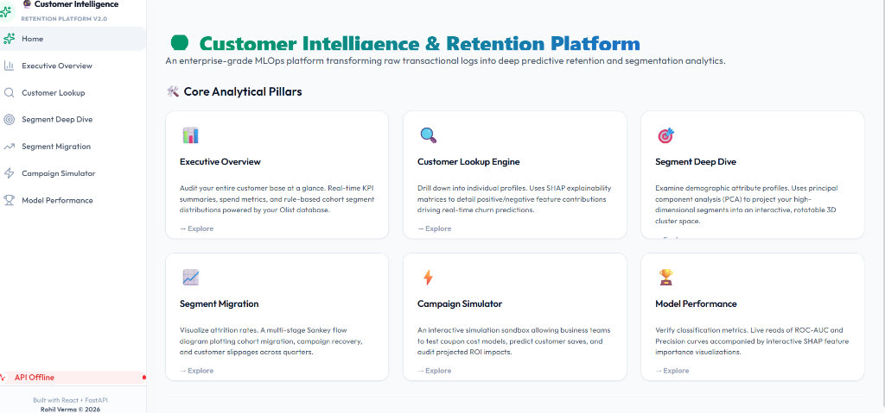
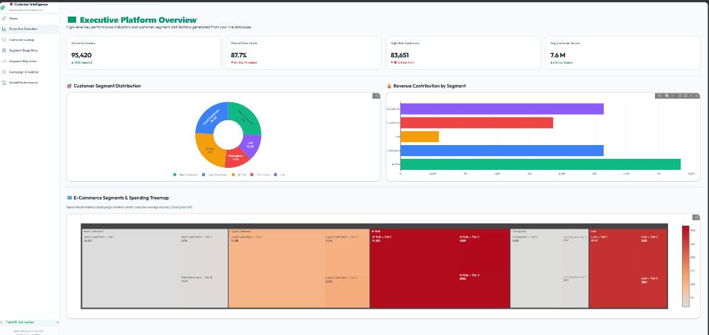
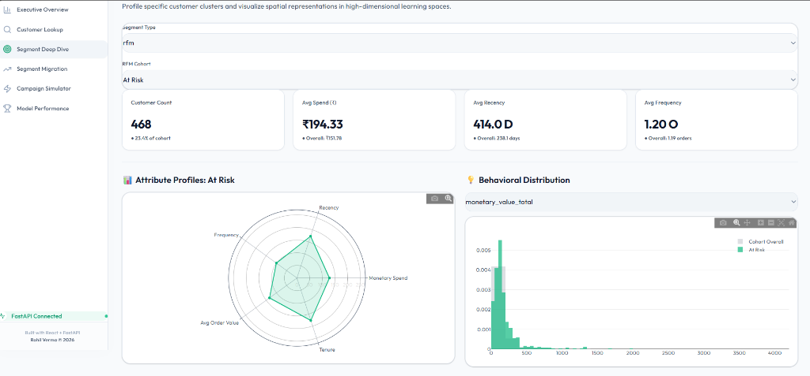
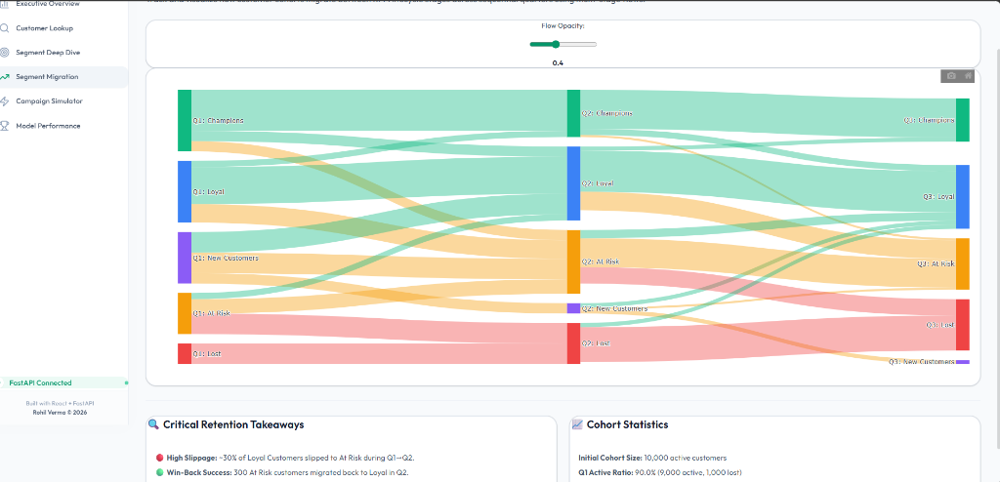
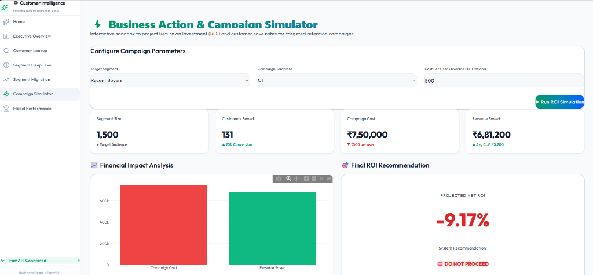

# Customer Intelligence & Retention Platform

An end-to-end machine learning system that transforms raw transactional data into actionable customer segments, churn predictions, and campaign simulations — served through a FastAPI backend and visualized in a React dashboard.

---

## 1. The Problem Statement

E-commerce platforms capture millions of transactions, yet most businesses struggle to convert raw purchase histories into actionable retention strategies. Without an integrated intelligence layer, companies face several key challenges:
* **Identification Failure**: Inability to identify which specific customer profiles are on the verge of churning (60+ days of inactivity) before they disappear.
* **Lack of Explainability**: Standard machine learning models act as "black boxes," predicting churn risk without revealing *why* a customer is drifting (e.g., delivery delays, drop in visit frequency, or review dissatisfaction).
* **Margin Erosion**: Blasting generic, site-wide discounts to the entire customer base drains profitability without addressing the root cause of churn for specific high-value cohorts.

---

## 2. Why This Issue Must Be Cured (The Impact)

* **High Acquisition Costs (CAC)**: Acquiring a new customer is **5x to 25x more expensive** than retaining an existing one. Minimizing churn directly optimizes marketing efficiency.
* **Revenue Concentration**: Across mature e-commerce platforms, the top **15% of loyal customers typically drive over 50% of total revenue**. Letting these high-value segments slip to "At Risk" results in massive revenue leakage.
* **Logistics & Satisfaction Correlation**: Delayed deliveries and poor review scores have a cascading impact on customer loyalty, which must be quantified to justify operational improvements.

---

## 3. The Solution

This platform acts as an **Enterprise Customer Data Platform (CDP) & MLOps System** built on the public [Brazilian E-Commerce (Olist)](https://www.kaggle.com/datasets/olistbr/brazilian-ecommerce) dataset (~100k orders). It handles the full pipeline:

1. **Robust Data Engineering**: Ingests 7 relational CSV tables and builds an optimized data warehouse schema. Features a **database-agnostic ETL engine** that connects to MySQL, dynamically creates schemas, and automatically falls back to local SQLite with DDL transpilation.
2. **Feature Engineering**: Derives 30+ behavioral features including RFM scores, purchase velocity, category diversity, weekend spend ratios, delivery delays, and review sentiment.
3. **ML Pipeline Orchestration**:
   * **Unsupervised Clustering**: Standardizes features using a `ColumnTransformer` (RobustScaler/StandardScaler/SimpleImputer) and runs K-Means (k=5) to segment customers into distinct behavioral profiles.
   * **Supervised Churn Prediction**: Trains an XGBoost Classifier (tuned with Optuna, using SMOTE to handle class imbalance) achieving **0.92 ROC-AUC and 0.82 F1**.
   * **Explainable AI (XAI)**: Generates SHAP explanation values for every single prediction, outputting the top 3 positive and negative churn drivers.
   * **Deep Learning Anomaly Detection**: Employs a PyTorch undercomplete Autoencoder to map latent buyer representations and flag anomalous behaviors.
4. **High-Availability Serving**: Exposes inference endpoints via FastAPI, utilizing **static JSON fallbacks** for seamless frontend execution if primary databases or model CSVs are offline during deployment.
5. **Interactive Dashboard**: A modern React + shadcn/ui SPA visualized using Plotly.js, featuring executive KPI summaries, segment deep-dives, migration flows, and a campaign ROI sandbox.

---

## 4. Tools Required

| Layer | Technologies & Libraries |
|---|---|
| **Data Science & ML** | Python, pandas, scikit-learn, XGBoost, PyTorch, SHAP, Optuna |
| **Backend API** | FastAPI, Uvicorn, Pydantic, joblib |
| **Database** | MySQL (warehouse schema), SQLite (feature store fallback), SQLAlchemy |
| **Frontend** | React 19, Vite, shadcn/ui, Tailwind CSS, Plotly.js, Framer Motion |
| **Infrastructure** | Render (API), Vercel (Frontend), Git & GitHub |

---

## 5. Project Structure

```
.
├── api/                    # FastAPI application layer
│   ├── main.py             #   Inference router and endpoints
│   ├── schemas.py          #   Pydantic payload validation models
│   ├── services.py         #   Model inference and database querying logic
│   └── static_data/        #   Pre-exported JSON snapshots for zero-downtime serving
├── src/                    # Data warehousing and machine learning pipeline
│   ├── config.py           #   Environment variables, paths, and constants
│   ├── data_processing.py  #   ETL pipeline and schema generator
│   ├── feature_engineering.py#   30+ analytical customer metrics
│   ├── train.py            #   Retraining orchestration script
│   ├── clustering/         #   RFM scoring and K-Means segmentation
│   └── models/             #   XGBoost, Autoencoder, and target labeling
├── frontend/               # React Dashboard SPA
│   ├── src/
│   │   ├── components/     #   Reusable UI widgets (Charts, Cards, Layout)
│   │   └── pages/          #   Dashboard pages (Overview, Lookup, Deep Dive, etc.)
│   └── package.json
├── docs/                   # Platform design documents
│   └── snapshots/          #   Dashboard screenshots for GitHub
├── sql/                    # Analytical SQL scripts (MySQL schema, cohorts)
├── tests/                  # Pytest automated test suite
├── requirements.txt        # Python dependency manifest
└── render.yaml             # Render deployment configuration
```

---

## 6. The Final Product: Dashboard Snapshots

### 🏠 Platform Home
The entry point of the platform, providing quick links to core analytical engines.


### 📊 Executive Overview
Top-line KPIs, segment counts, revenue contribution charts, and spending treemaps by region.


### 🔬 Segment Deep Dive
Profiles customer cohorts, visualizing their characteristics via radar charts and behavioral distributions.


### 📈 Segment Migration
Sankey-style flow diagram visualizing customer slippage and retention recovery across quarters.


### ⚡ Campaign Simulator
An interactive ROI sandbox enabling marketing teams to test discount campaigns, costs, and save-rate outcomes before allocating budget.


---

## 7. Key Observations

* **The Power of Champions**: Champions make up ~13.5% of the customer base but account for nearly **28% of total revenue**. Retaining this segment requires VIP rewards, early access, and premium services rather than margin-draining discount codes.
* **Customer Slippage Rate**: Approximately **30% of Loyal customers** slip into the "At Risk" category every quarter, highlighting a critical window between 30 and 45 days of inactivity where automated re-engagement triggers must be deployed.
* **ROI Optimization**: Simulating campaign outcomes reveals that running generic, mass-email campaigns often results in negative ROI. In contrast, target-segment campaigns (such as a personal outreach call to At-Risk buyers with high average order values) yield positive returns.
* **Autoencoder Anomalies**: Anomaly scoring reveals that customers with high reconstruction error (MSE) represent bulk reseller accounts or voucher abusers, allowing the business to filter them out of standard retail marketing campaigns.
