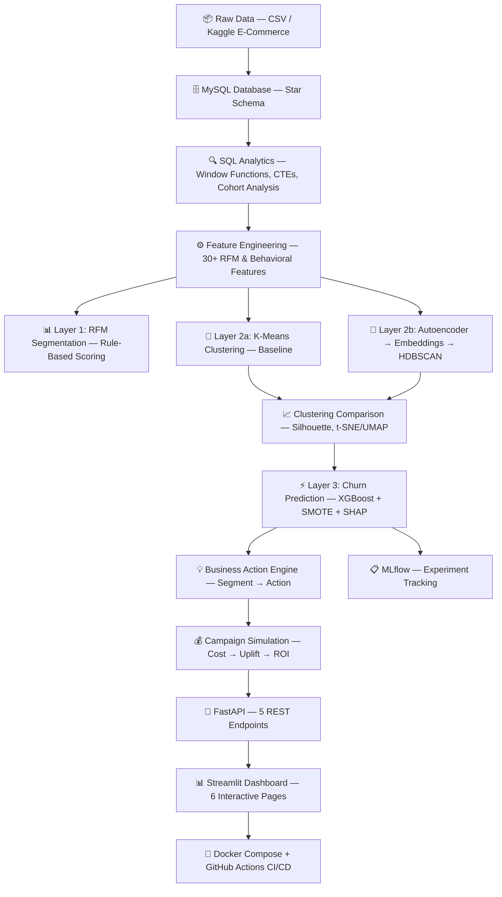

# Product Requirements Document (PRD)
## Customer Intelligence & Retention Platform

| Field              | Value                                                        |
| :----------------- | :----------------------------------------------------------- |
| **Document Owner** | Rohil Verma                                                  |
| **Version**        | 1.0                                                          |
| **Created**        | 2026-05-27                                                   |
| **Status**         | Approved for Development                                     |
| **Timeline**       | ~7 weeks (part-time alongside M.Tech)                        |
| **Repository**     | `github.com/rohilverma/customer-intelligence-platform` (TBD) |

---

## Table of Contents

1. [Executive Summary](#1-executive-summary)
2. [Problem Statement](#2-problem-statement)
3. [Objectives & Success Criteria](#3-objectives--success-criteria)
4. [Target Audience](#4-target-audience)
5. [Scope](#5-scope)
6. [System Architecture](#6-system-architecture)
7. [Data Requirements](#7-data-requirements)
8. [Functional Requirements](#8-functional-requirements)
9. [Non-Functional Requirements](#9-non-functional-requirements)
10. [Tech Stack](#10-tech-stack)
11. [Directory Structure](#11-directory-structure)
12. [API Specification](#12-api-specification)
13. [Dashboard Specification](#13-dashboard-specification)
14. [Implementation Phases](#14-implementation-phases)
15. [Testing Strategy](#15-testing-strategy)
16. [Risks & Mitigations](#16-risks--mitigations)
17. [Out of Scope](#17-out-of-scope)
18. [Resume Positioning](#18-resume-positioning)
19. [References](#19-references)

---

# 1. Executive Summary

### What
An end-to-end, production-grade **Customer Intelligence Platform** that dynamically segments e-commerce customers using multi-layer analysis (RFM + behavioral clustering + autoencoder-based representation learning), predicts churn risk with explainable AI, and simulates the ROI of retention campaigns — all served through a FastAPI backend and interactive Streamlit dashboard, containerized with Docker.

### Why
This project is purpose-built to demonstrate the exact skills demanded by 7 target companies (Wipro, HCL Tech, TCS, Infosys, Zomato, Swiggy, Flipkart) for Data Science roles requiring 0–4 years of experience. It covers Classical ML, Deep Learning, SQL, Explainability, Product Thinking, MLOps, and Deployment in a single, cohesive project.

### How
The system follows a layered architecture: **Ingest → SQL Analytics → Feature Engineering → Segment → Predict → Explain → Simulate → Serve → Visualize → Deploy**.

---

# 2. Problem Statement

### Business Context
Most companies lose revenue because they treat all customers identically:
- Sending the same discount to every user regardless of value or behavior
- Failing to identify high-value customers for premium treatment
- Not detecting churn-prone users until they've already left
- Running campaigns without estimating return on investment
- Lacking visibility into how customer segments evolve over time

### What This System Solves
The platform answers critical business questions:

| Question                                            | System Component             |
| :-------------------------------------------------- | :--------------------------- |
| Who are our most valuable customers?                | RFM Segmentation (Layer 1)   |
| What behavioral groups exist in our customer base?  | Clustering (Layer 2)         |
| Which customers are likely to churn?                | Churn Prediction (Layer 3)   |
| *Why* is a specific customer at risk?               | SHAP Explainability          |
| What action should we take for each segment?        | Business Action Engine       |
| If we run this campaign, what's the projected ROI?  | Campaign Simulation Layer    |
| How do customer segments change over time?          | Segment Migration Tracking   |

---

# 3. Objectives & Success Criteria

### Primary Objectives

| # | Objective                                                                 | Measurable Outcome                                                  |
|---|---------------------------------------------------------------------------|---------------------------------------------------------------------|
| 1 | Demonstrate end-to-end ML pipeline capability                            | Complete data → model → API → dashboard → Docker pipeline           |
| 2 | Demonstrate advanced SQL proficiency                                     | 5+ SQL scripts with window functions, CTEs, cohort analysis         |
| 3 | Demonstrate Classical ML + Explainability                                | XGBoost model with AUC ≥ 0.85 + full SHAP analysis                 |
| 4 | Demonstrate Deep Learning understanding                                  | Autoencoder embeddings with comparison to K-Means baseline          |
| 5 | Demonstrate product/business thinking                                    | Campaign simulation with quantified ROI estimates                   |
| 6 | Create a visually professional GitHub portfolio piece                    | Mermaid architecture diagram + screenshots in README                |
| 7 | Produce interview-ready talking points                                   | 2 polished resume bullet points + 5+ interview discussion topics    |

### Model Performance Targets

| Model              | Metric     | Target   | Stretch  |
| :------------------ | :--------- | :------- | :------- |
| Churn (XGBoost)    | ROC-AUC    | ≥ 0.85   | ≥ 0.92   |
| Churn (XGBoost)    | F1-Score   | ≥ 0.75   | ≥ 0.82   |
| Churn (XGBoost)    | Recall     | ≥ 0.80   | ≥ 0.88   |
| K-Means Clustering | Silhouette | ≥ 0.30   | ≥ 0.45   |
| Autoencoder + HDBSCAN | Silhouette | ≥ 0.35 | ≥ 0.50   |

---

# 4. Target Audience

### 4.1 Primary: Recruiters & Hiring Managers
At the 7 target companies, evaluating candidates for Data Scientist / ML Engineer roles (0–4 YOE).

**What they look for in a portfolio project:**
- Business problem framing (not just a Kaggle notebook)
- End-to-end lifecycle (data → production)
- Clean code, modular architecture
- Visual results (dashboard screenshots, architecture diagrams)
- Deployment (Docker, API) — not just a `.ipynb` file

### 4.2 Secondary: Technical Interviewers
Data Scientists and ML Engineers who will deep-dive into methodology, code quality, and design decisions during technical rounds.

**What they probe:**
- "Why XGBoost over LightGBM?"
- "How did you handle class imbalance?"
- "Explain SHAP — what does a negative SHAP value mean?"
- "Why autoencoder embeddings instead of PCA?"
- "How would you scale this to 100M customers?"

### 4.3 Company Mapping

| Company    | What They Care About Most                          | How This Project Maps                                   |
| :--------- | :------------------------------------------------- | :------------------------------------------------------ |
| Flipkart   | Customer lifecycle, recommendations, scale         | Multi-layer segmentation, CLV, segment migration        |
| Zomato     | Demand forecasting, churn, delivery optimization   | Churn prediction, SHAP, campaign simulation             |
| Swiggy     | Experimentation, uplift, product analytics         | Campaign simulation layer, ROI estimation               |
| Wipro      | Client-facing solutions, dashboards, SQL           | SQL layer, Streamlit dashboard, FastAPI                  |
| HCL Tech   | MLOps, Docker, cross-functional collaboration      | Docker Compose, MLflow, modular architecture            |
| TCS        | End-to-end project lifecycle, mathematical depth   | Full pipeline, Autoencoder, statistical tests           |
| Infosys    | End-to-end ML, visualizations, certifications      | Complete lifecycle, Plotly/Seaborn visualizations        |

---

# 5. Scope

### 5.1 In Scope

| Category                   | Deliverables                                                              |
| :------------------------- | :------------------------------------------------------------------------ |
| **Data Engineering**       | MySQL star schema, ETL pipeline, 5+ SQL analytics scripts                 |
| **EDA**                    | Comprehensive EDA notebook with 15+ visualizations                        |
| **Feature Engineering**    | 30+ features (RFM, behavioral, predictive)                                |
| **Segmentation — Layer 1** | RFM scoring and rule-based segmentation                                   |
| **Segmentation — Layer 2** | K-Means (baseline) + Autoencoder → HDBSCAN (advanced) + comparison       |
| **Prediction — Layer 3**   | Churn prediction: XGBoost + LR/RF comparison + SMOTE + Optuna + MLflow   |
| **Explainability**         | SHAP — global summary, local waterfall, dependence plots                  |
| **Business Actions**       | Segment → action → estimated ROI mapping engine                           |
| **Campaign Simulation**    | Interactive cost/uplift/revenue simulation per segment × campaign type    |
| **Segment Migration**      | Monthly batch snapshot comparison, migration matrix/Sankey                 |
| **API**                    | FastAPI with 5+ endpoints, Pydantic validation, Swagger docs              |
| **Dashboard**              | Streamlit with 6 pages                                                    |
| **Deployment**             | Docker Compose (FastAPI + Streamlit), GitHub Actions CI/CD                |
| **Documentation**          | Professional README with Mermaid architecture diagram, screenshots        |

### 5.2 Out of Scope (see [Section 17](#17-out-of-scope) for full list)
- Real-time streaming (Kafka)
- Kubernetes orchestration
- Cloud deployment (AWS/GCP) — mentioned in docs as "production upgrade"
- Apache Spark / big data processing
- Apache Airflow orchestration
- Recommendation engine (separate project)

---

# 6. System Architecture

### 6.1 High-Level Architecture

```
┌─────────────────────────────────────────────────────────────────────────────┐
│                    CUSTOMER INTELLIGENCE PLATFORM                          │
│                                                                             │
│  DATA LAYER                                                                 │
│  ┌───────────┐    ┌───────────────┐    ┌───────────────────────┐           │
│  │ Raw CSV   │───▶│ Python ETL    │───▶│ MySQL / PostgreSQL    │           │
│  │ (Kaggle)  │    │ (Pandas)      │    │ (Star Schema)         │           │
│  └───────────┘    └───────────────┘    └──────────┬────────────┘           │
│                                                    │                        │
│  SQL ANALYTICS LAYER                               │                        │
│  ┌────────────────────────────────────────────────┐│                        │
│  │ Window Functions │ CTEs │ Cohort Analysis      ││                        │
│  │ Joins            │ Aggregations │ Subqueries   ││                        │
│  └────────────────────────────────────────────────┘│                        │
│                                                    ▼                        │
│  FEATURE ENGINEERING                                                        │
│  ┌──────────┐    ┌──────────────┐    ┌──────────────────┐                  │
│  │ RFM      │    │ Behavioral   │    │ Predictive       │                  │
│  │ Features │    │ Features     │    │ Features         │                  │
│  │ (3)      │    │ (20+)        │    │ (7+)             │                  │
│  └────┬─────┘    └──────┬───────┘    └────────┬─────────┘                  │
│       │                 │                      │                            │
│  SEGMENTATION ENGINE    │                      │                            │
│       ▼                 ▼                      │                            │
│  ┌──────────┐    ┌────────────────────┐        │                            │
│  │ Layer 1  │    │     Layer 2        │        │                            │
│  │ RFM      │    │ ┌────────────────┐ │        │                            │
│  │ Scoring  │    │ │ Path A: K-Means│ │        │                            │
│  │ (Rules)  │    │ │ (Baseline)     │ │        │                            │
│  └──────────┘    │ ├────────────────┤ │        │                            │
│                  │ │ Path B:        │ │        │                            │
│                  │ │ Autoencoder →  │ │        │                            │
│                  │ │ Embeddings →   │ │        │                            │
│                  │ │ HDBSCAN        │ │        │                            │
│                  │ └────────────────┘ │        │                            │
│                  └────────┬───────────┘        │                            │
│                           │                    │                            │
│  PREDICTIVE LAYER         ▼                    ▼                            │
│  ┌──────────────────────────────────────────────────┐                       │
│  │ Layer 3: Predictive Intelligence                 │                       │
│  │ ┌──────────────┐ ┌──────────┐ ┌───────────────┐ │                       │
│  │ │ Churn Pred.  │ │ CLV Est. │ │ Segment       │ │                       │
│  │ │ XGBoost +    │ │ (Linear  │ │ Migration     │ │                       │
│  │ │ SMOTE +      │ │ Regr.)   │ │ Tracking      │ │                       │
│  │ │ Optuna       │ │          │ │ (Batch)       │ │                       │
│  │ └──────┬───────┘ └──────────┘ └───────────────┘ │                       │
│  └────────┼────────────────────────────────────────-┘                       │
│           │                                                                 │
│  INTELLIGENCE LAYER                                                         │
│  ┌────────▼────────┐    ┌─────────────────┐    ┌──────────────────┐        │
│  │ SHAP             │───▶│ Business Action │───▶│ Campaign         │        │
│  │ Explainability    │    │ Engine          │    │ Simulation       │        │
│  │ (Global + Local)  │    │ (Segment→Action)│    │ (Cost→Uplift→ROI)│       │
│  └──────────────────┘    └─────────────────┘    └────────┬─────────┘        │
│                                                           │                 │
│  SERVING LAYER                                            │                 │
│  ┌───────────────────┐    ┌──────────────────────────┐    │                 │
│  │ FastAPI            │◀───│ MLflow                   │    │                 │
│  │ (5 REST Endpoints) │    │ (Experiment Tracking)    │    │                 │
│  └─────────┬─────────┘    └──────────────────────────┘    │                 │
│            │                                               │                │
│  PRESENTATION LAYER                                        │                │
│  ┌─────────▼──────────────────────────────────────────────▼──┐             │
│  │ Streamlit Dashboard (6 Pages)                              │             │
│  │ ┌──────────┐ ┌──────────┐ ┌──────────┐ ┌───────────────┐ │             │
│  │ │Executive │ │Customer  │ │Segment   │ │Migration      │ │             │
│  │ │Overview  │ │Lookup    │ │Deep Dive │ │Over Time      │ │             │
│  │ ├──────────┤ ├──────────┤ ├──────────┤ ├───────────────┤ │             │
│  │ │Campaign  │ │Model     │ │          │ │               │ │             │
│  │ │Simulator │ │Performnce│ │          │ │               │ │             │
│  │ └──────────┘ └──────────┘ └──────────┘ └───────────────┘ │             │
│  └───────────────────────────────────────────────────────────┘             │
│                                                                             │
│  DEPLOYMENT                                                                 │
│  ┌─────────────────────────────────────────────────────────────┐           │
│  │ Docker Compose (FastAPI + Streamlit) + GitHub Actions CI/CD │           │
│  └─────────────────────────────────────────────────────────────┘           │
└─────────────────────────────────────────────────────────────────────────────┘
```

### 6.2 Mermaid Architecture Diagram (for GitHub README)



### 6.3 Data Flow Summary

```
CSV  →  ETL  →  MySQL  →  SQL Queries  →  Pandas  →  Feature Matrix
                                                           │
                            ┌──────────────────────────────┤
                            ▼                              ▼
                     RFM Scoring                  Autoencoder (PyTorch)
                            │                              │
                            ▼                              ▼
                      K-Means                   Behavioral Embeddings
                            │                              │
                            │                              ▼
                            │                          HDBSCAN
                            │                              │
                            └──────────┬───────────────────┘
                                       ▼
                              Unified Customer Profile
                              (Segment + Features + Embedding)
                                       │
                            ┌──────────┤
                            ▼          ▼
                     XGBoost       CLV Regression
                     (Churn)       (Lifetime Value)
                            │          │
                            ▼          ▼
                     SHAP Values   Segment Migration
                            │          │
                            └──────┬───┘
                                   ▼
                        Business Action Engine
                                   │
                                   ▼
                        Campaign Simulation
                                   │
                        ┌──────────┤
                        ▼          ▼
                    FastAPI    Streamlit
                        │          │
                        └────┬─────┘
                             ▼
                      Docker Compose
```

---

# 7. Data Requirements

### 7.1 Primary Dataset

| Attribute        | Specification                                                                 |
| :--------------- | :---------------------------------------------------------------------------- |
| **Dataset**      | E-Commerce Customer Churn Dataset (Kaggle)                                   |
| **Alt. Dataset** | Online Retail Dataset (UCI / Kaggle) — if more transactional data needed     |
| **Size**         | ~100K+ rows, 20+ raw columns                                                 |
| **Type**         | Transactional + behavioral customer data                                      |
| **Key Fields**   | Customer ID, purchase date, amount, product category, tenure, complaints, satisfaction score, churn label |

### 7.2 Database Schema (Star Schema)

```
                    ┌─────────────────────┐
                    │   fact_transactions  │
                    ├─────────────────────┤
                    │ transaction_id (PK) │
                    │ customer_id (FK)    │
                    │ product_id (FK)     │
                    │ date_id (FK)        │
                    │ quantity            │
                    │ unit_price          │
                    │ total_amount        │
                    │ discount_applied    │
                    │ delivery_days       │
                    └────────┬────────────┘
                             │
            ┌────────────────┼────────────────┐
            ▼                ▼                ▼
  ┌───────────────┐ ┌──────────────┐ ┌──────────────┐
  │ dim_customers │ │ dim_products │ │ dim_dates    │
  ├───────────────┤ ├──────────────┤ ├──────────────┤
  │ customer_id   │ │ product_id   │ │ date_id      │
  │ signup_date   │ │ category     │ │ date         │
  │ city_tier     │ │ subcategory  │ │ day_of_week  │
  │ gender        │ │ brand        │ │ month        │
  │ device_pref   │ │ price_range  │ │ quarter      │
  │ payment_mode  │ │              │ │ is_weekend   │
  │ marital_status│ │              │ │ is_holiday   │
  └───────────────┘ └──────────────┘ └──────────────┘
```

### 7.3 SQL Analytics Scripts (5+ Required)

| Script # | Filename                       | Techniques Demonstrated                           |
| :------- | :----------------------------- | :------------------------------------------------ |
| 01       | `01_schema_creation.sql`       | DDL, constraints, indexes, foreign keys           |
| 02       | `02_data_loading.sql`          | LOAD DATA, INSERT, data type casting              |
| 03       | `03_rfm_analysis.sql`          | Window functions (NTILE, ROW_NUMBER), CTEs, CASE  |
| 04       | `04_cohort_analysis.sql`       | Self-joins, date arithmetic, retention matrices   |
| 05       | `05_churn_segmentation.sql`    | Subqueries, HAVING, aggregation, COALESCE         |
| 06       | `06_advanced_analytics.sql`    | LEAD/LAG, running totals, percentile calculations |

---

# 8. Functional Requirements

### FR-1: Data Ingestion & ETL

| ID    | Requirement                                                          | Priority  |
| :---- | :------------------------------------------------------------------- | :-------- |
| FR1.1 | Load raw CSV data into MySQL database via Python ETL script          | P0        |
| FR1.2 | Implement star schema (fact_transactions + 3 dimension tables)       | P0        |
| FR1.3 | Handle data quality issues (nulls, duplicates, type mismatches)      | P0        |
| FR1.4 | Generate ER diagram and document schema                              | P1        |

### FR-2: Exploratory Data Analysis (EDA)

| ID    | Requirement                                                          | Priority  |
| :---- | :------------------------------------------------------------------- | :-------- |
| FR2.1 | Distribution analysis for all numerical features (histograms, KDE)   | P0        |
| FR2.2 | Correlation heatmap (Pearson / Spearman)                             | P0        |
| FR2.3 | Churn rate breakdown by categorical features (bar charts)            | P0        |
| FR2.4 | Target variable class imbalance analysis                             | P0        |
| FR2.5 | Statistical significance tests (Chi-square, Welch's t-test)          | P1        |
| FR2.6 | Generate 15+ publication-quality plots saved to `/plots/`            | P0        |

### FR-3: Feature Engineering

| ID    | Requirement                                                          | Priority  |
| :---- | :------------------------------------------------------------------- | :-------- |
| FR3.1 | Compute RFM features (Recency, Frequency, Monetary)                  | P0        |
| FR3.2 | Engineer 20+ behavioral features (see table below)                   | P0        |
| FR3.3 | Engineer predictive features (engagement decline, trend velocity)     | P1        |
| FR3.4 | Handle missing values with documented strategy                       | P0        |
| FR3.5 | Encode categorical variables (One-Hot or Target Encoding)            | P0        |
| FR3.6 | Scale numerical features (StandardScaler / RobustScaler)             | P0        |

**Behavioral Feature Catalog (minimum 20):**

| #  | Feature Name                 | Description                                          |
| :- | :--------------------------- | :--------------------------------------------------- |
| 1  | avg_order_value              | Mean transaction amount per customer                 |
| 2  | purchase_interval_days       | Mean days between consecutive purchases              |
| 3  | basket_diversity             | Unique product categories purchased                  |
| 4  | discount_dependency_ratio    | % of orders that used a discount                     |
| 5  | delivery_delay_tolerance     | Avg tolerance for late deliveries (days)             |
| 6  | session_frequency            | Number of app/web sessions per month                 |
| 7  | time_of_day_preference       | Most common order hour bucket                        |
| 8  | category_affinity_score      | Concentration of purchases in top category           |
| 9  | device_platform_usage        | Desktop vs Mobile ratio                              |
| 10 | repeat_purchase_ratio        | % of purchases that are repeat items                 |
| 11 | refund_frequency             | Number of refund/return requests                     |
| 12 | complaint_count              | Total complaints filed                               |
| 13 | satisfaction_score_avg       | Average satisfaction rating                          |
| 14 | tenure_months                | Customer age in months                               |
| 15 | total_spend                  | Lifetime total spend                                 |
| 16 | spend_trend_3m               | Spend change over last 3 months (slope)              |
| 17 | purchase_frequency_trend     | Purchase frequency change (accelerating/decelerating)|
| 18 | days_since_last_login        | Recency of last app/web activity                     |
| 19 | coupon_usage_rate            | % of available coupons redeemed                      |
| 20 | payment_method_diversity     | Number of unique payment methods used                |
| 21 | weekend_vs_weekday_ratio     | % of orders placed on weekends                       |
| 22 | avg_items_per_order          | Mean items per transaction                           |

### FR-4: Layer 1 — RFM Segmentation

| ID    | Requirement                                                          | Priority  |
| :---- | :------------------------------------------------------------------- | :-------- |
| FR4.1 | Compute R, F, M scores using quartile-based NTILE (1–5 each)        | P0        |
| FR4.2 | Assign composite RFM segment labels                                  | P0        |
| FR4.3 | Map RFM scores to business-readable segment names                    | P0        |

**RFM Segment Mapping:**

| RFM Score Range | Segment Name        | Business Description                        |
| :-------------- | :------------------ | :------------------------------------------ |
| 555, 554, 545   | Champions           | Best customers — bought recently, often, big |
| 553, 552, 551   | Loyal Customers     | Buy consistently, high frequency             |
| 511, 512, 521   | Recent Customers    | Bought recently but not frequently           |
| 311, 312, 321   | At Risk             | Were good customers, slipping away           |
| 111, 112, 121   | Lost / Hibernating  | Haven't purchased in a long time             |
| 411, 412, 421   | Needs Attention     | Above average but showing decline            |

### FR-5: Layer 2 — Behavioral Clustering

| ID    | Requirement                                                          | Priority  |
| :---- | :------------------------------------------------------------------- | :-------- |
| FR5.1 | Run K-Means clustering on standardized raw features (baseline)       | P0        |
| FR5.2 | Determine optimal K using Elbow method + Silhouette analysis         | P0        |
| FR5.3 | Build Autoencoder (PyTorch) on normalized feature matrix             | P0        |
| FR5.4 | Extract bottleneck embeddings (8–16 dimensions)                      | P0        |
| FR5.5 | Run HDBSCAN on autoencoder embeddings                                | P0        |
| FR5.6 | Compare Path A (K-Means) vs Path B (Autoencoder+HDBSCAN)            | P0        |
| FR5.7 | Visualize both approaches with t-SNE or UMAP side-by-side            | P0        |
| FR5.8 | Report comparison metrics (Silhouette, Davies-Bouldin)               | P0        |

**Autoencoder Specification:**

| Parameter          | Value                                      |
| :----------------- | :----------------------------------------- |
| Type               | Undercomplete autoencoder                  |
| Framework          | PyTorch                                    |
| Input dimension    | Number of features (30+)                   |
| Architecture       | Input → 64 → 32 → **Bottleneck (16)** → 32 → 64 → Input |
| Activation         | ReLU (hidden), Sigmoid/Linear (output)     |
| Loss               | MSE (reconstruction loss)                  |
| Optimizer          | Adam (lr=1e-3)                             |
| Epochs             | 100–200 with early stopping                |
| Batch size         | 256                                        |
| Output             | Bottleneck activations as "embeddings"     |

### FR-6: Layer 3 — Predictive Intelligence

| ID    | Requirement                                                          | Priority  |
| :---- | :------------------------------------------------------------------- | :-------- |
| FR6.1 | Train baseline models: Logistic Regression, Random Forest            | P0        |
| FR6.2 | Train primary model: XGBoost                                         | P0        |
| FR6.3 | Handle class imbalance with SMOTE and scale_pos_weight               | P0        |
| FR6.4 | Hyperparameter tuning with Optuna (≥50 trials)                       | P0        |
| FR6.5 | Track all experiments in MLflow (params, metrics, artifacts)         | P0        |
| FR6.6 | Evaluate: ROC-AUC, F1, Precision, Recall, Confusion Matrix          | P0        |
| FR6.7 | Stratified K-Fold cross-validation (k=5)                             | P0        |
| FR6.8 | Model comparison table                                               | P0        |
| FR6.9 | Serialize best model + encoders with joblib                          | P0        |
| FR6.10| CLV estimation using simple linear/Ridge regression (optional)       | P2        |
| FR6.11| Segment migration tracking across 2–3 monthly batch snapshots        | P1        |

### FR-7: Explainability (SHAP)

| ID    | Requirement                                                          | Priority  |
| :---- | :------------------------------------------------------------------- | :-------- |
| FR7.1 | Global SHAP summary plot (beeswarm)                                  | P0        |
| FR7.2 | Local SHAP waterfall plot for individual customer predictions        | P0        |
| FR7.3 | SHAP dependence plots for top 5 features                             | P1        |
| FR7.4 | Feature importance bar chart (mean |SHAP|)                           | P0        |

### FR-8: Business Action Engine

| ID    | Requirement                                                          | Priority  |
| :---- | :------------------------------------------------------------------- | :-------- |
| FR8.1 | Map churn risk levels (Low / Medium / High) via probability thresholds | P0      |
| FR8.2 | Map top SHAP features to recommended business actions                | P0        |
| FR8.3 | Create segment × risk matrix with prescribed actions                 | P0        |

**Business Action Mapping:**

| Segment              | Risk Level | Recommended Action                | Estimated Cost/User |
| :------------------- | :--------- | :-------------------------------- | :------------------ |
| Champions            | Low        | VIP rewards, early access         | ₹200                |
| Loyal Customers      | Low        | Loyalty program, referral bonus   | ₹150                |
| Recent Customers     | Medium     | Onboarding campaign, tutorials    | ₹100                |
| At Risk              | High       | Retention discount (15–20%)       | ₹500                |
| Needs Attention      | High       | Personal outreach, survey         | ₹300                |
| Lost / Hibernating   | Very High  | Win-back campaign (conditional)   | ₹400                |

### FR-9: Campaign Simulation Layer

| ID    | Requirement                                                          | Priority  |
| :---- | :------------------------------------------------------------------- | :-------- |
| FR9.1 | Define 3+ campaign templates (discount, loyalty, onboarding)         | P0        |
| FR9.2 | For each segment × campaign, calculate: cost, uplift, revenue saved  | P0        |
| FR9.3 | Compute ROI per segment × campaign combination                       | P0        |
| FR9.4 | Output a ROI comparison table                                        | P0        |
| FR9.5 | Interactive Streamlit page: select segment + campaign → see ROI      | P0        |
| FR9.6 | Sankey diagram: Segment → Campaign → Projected Outcome               | P1        |

**Campaign Templates:**

| Campaign ID | Name                    | Cost/User | Assumed Churn Reduction | Duration  |
| :---------- | :---------------------- | :-------- | :---------------------- | :-------- |
| C1          | Flat discount (20%)     | ₹500      | 30%                     | 3 months  |
| C2          | Loyalty points (2x)     | ₹200      | 15%                     | 6 months  |
| C3          | Personal outreach call  | ₹300      | 25%                     | 1 month   |
| C4          | Onboarding email series | ₹50       | 10%                     | 2 weeks   |

**ROI Formula:**
```
Customers_Saved = Segment_Size × Assumed_Churn_Reduction
Revenue_Saved   = Customers_Saved × Avg_CLV
Campaign_Cost   = Segment_Size × Cost_Per_User
ROI             = (Revenue_Saved - Campaign_Cost) / Campaign_Cost × 100
```

### FR-10: API (FastAPI)

| ID     | Requirement                                                         | Priority  |
| :----- | :------------------------------------------------------------------ | :-------- |
| FR10.1 | `POST /predict-churn` — single customer → churn prob + SHAP + action| P0        |
| FR10.2 | `POST /segment` — single customer → segment label + description     | P0        |
| FR10.3 | `POST /batch-predict` — CSV upload → full predictions for all       | P1        |
| FR10.4 | `POST /simulate-campaign` — segment + campaign → ROI projection     | P0        |
| FR10.5 | `GET /health` — service health check                                | P0        |
| FR10.6 | `GET /model-info` — model version, training date, performance       | P1        |
| FR10.7 | Pydantic request/response validation schemas                        | P0        |
| FR10.8 | Auto-generated Swagger docs at `/docs`                              | P0        |

### FR-11: Dashboard (Streamlit)

See [Section 13](#13-dashboard-specification) for detailed page-by-page specification.

### FR-12: Deployment

| ID     | Requirement                                                         | Priority  |
| :----- | :------------------------------------------------------------------ | :-------- |
| FR12.1 | Dockerfile for FastAPI backend                                      | P0        |
| FR12.2 | Dockerfile for Streamlit frontend                                   | P0        |
| FR12.3 | docker-compose.yml to orchestrate both services                     | P0        |
| FR12.4 | GitHub Actions CI: run pytest + linting on push                     | P1        |
| FR12.5 | .env.example for configuration variables                            | P0        |

---

# 9. Non-Functional Requirements

| ID    | Category          | Requirement                                                    |
| :---- | :---------------- | :------------------------------------------------------------- |
| NFR1  | Code Quality      | Modular, PEP 8 compliant Python code with docstrings           |
| NFR2  | Code Quality      | Type hints on all public function signatures                   |
| NFR3  | Reproducibility   | `requirements.txt` with pinned versions                        |
| NFR4  | Reproducibility   | Random seed set globally (42) for all ML operations            |
| NFR5  | Performance       | API response time < 500ms for single prediction                |
| NFR6  | Performance       | Dashboard pages load in < 3 seconds                            |
| NFR7  | Documentation     | Professional README.md with architecture diagram, screenshots  |
| NFR8  | Documentation     | Inline comments for non-obvious logic                          |
| NFR9  | Testing           | ≥ 10 unit tests covering critical paths                        |
| NFR10 | Version Control   | Meaningful commit messages, feature-branch workflow             |
| NFR11 | Security          | No hardcoded API keys or credentials; use .env files           |
| NFR12 | Portability       | Full project runs with `docker-compose up` on any machine      |

---

# 10. Tech Stack

### 10.1 Core Stack (All Required)

| Category               | Technology                   | Version    | Purpose                              |
| :--------------------- | :--------------------------- | :--------- | :----------------------------------- |
| Language               | Python                       | 3.11+      | All application code                 |
| Data Processing        | Pandas                       | 2.x        | Data manipulation                    |
| Numerical Computing    | NumPy                        | 1.26+      | Array operations                     |
| Database               | MySQL or PostgreSQL           | 8.x / 16.x | Star schema, SQL demonstrations     |
| SQL Connector          | SQLAlchemy + PyMySQL          | 2.x        | Python ↔ database                    |
| EDA Visualization      | Matplotlib + Seaborn          | 3.x / 0.13 | Static plots                        |
| Interactive Viz        | Plotly                       | 5.x        | Dashboard charts                     |
| Classical ML           | Scikit-learn                 | 1.4+       | Preprocessing, baseline models       |
| Gradient Boosting      | XGBoost                      | 2.x        | Primary churn model                  |
| Deep Learning          | PyTorch                      | 2.x        | Autoencoder for embeddings           |
| Clustering             | HDBSCAN (hdbscan)            | 0.8+       | Density-based clustering             |
| Explainability         | SHAP                         | 0.44+      | Model interpretability               |
| Imbalanced Data        | imbalanced-learn             | 0.12+      | SMOTE oversampling                   |
| Hyperparameter Tuning  | Optuna                       | 3.x        | Bayesian optimization                |
| Experiment Tracking    | MLflow                       | 2.x        | Log params, metrics, artifacts       |
| Dimensionality Reduc.  | UMAP (umap-learn)            | 0.5+       | Embedding visualization              |
| API Framework          | FastAPI                      | 0.110+     | REST API backend                     |
| API Server             | Uvicorn                      | 0.29+      | ASGI server                          |
| API Validation         | Pydantic                     | 2.x        | Request/response schemas             |
| Dashboard              | Streamlit                    | 1.35+      | Interactive frontend                 |
| Containerization       | Docker + Docker Compose      | 24.x       | Deployment                           |
| Version Control        | Git + GitHub                 | —          | Code management                      |
| CI/CD                  | GitHub Actions               | —          | Automated testing & linting          |
| Testing                | pytest                       | 8.x        | Unit tests                           |
| Linting                | ruff                         | 0.4+       | Code quality                         |
| Serialization          | joblib                       | 1.x        | Model persistence                    |

### 10.2 Explicitly NOT Used (Conscious Decisions)

| Technology   | Reason Not Used                                    | README Mention                           |
| :----------- | :------------------------------------------------- | :--------------------------------------- |
| Apache Spark | Dataset fits in memory; Pandas is sufficient       | "Architecture designed for Spark scale"  |
| Apache Airflow | Adds complexity without portfolio value          | "Production upgrade: Airflow scheduling" |
| Kafka        | No real-time requirement; batch is honest          | "Streaming-ready architecture"           |
| Kubernetes   | Docker Compose is sufficient for demonstration     | "K8s-ready containerization"             |
| Redis        | No caching needed at this scale                    | —                                        |
| Feast        | Feature store adds overhead without portfolio ROI  | "Feature Store: production upgrade"      |

---

# 11. Directory Structure

```
customer-intelligence-platform/
│
├── README.md                          # Project overview + Mermaid diagram + screenshots
├── PRD.md                             # This document
├── docker-compose.yml                 # Orchestrate FastAPI + Streamlit
├── .env.example                       # Environment variable template
├── .gitignore                         # Python, Jupyter, MLflow ignores
├── requirements.txt                   # Pinned Python dependencies
│
├── .github/
│   └── workflows/
│       └── ci.yml                     # GitHub Actions: pytest + ruff lint
│
├── data/
│   ├── raw/                           # Original CSV files (gitignored if large)
│   └── processed/                     # Cleaned and feature-engineered data
│
├── sql/
│   ├── 01_schema_creation.sql         # DDL: star schema definition
│   ├── 02_data_loading.sql            # Data ingestion scripts
│   ├── 03_rfm_analysis.sql            # Window functions, NTILE, CTEs
│   ├── 04_cohort_analysis.sql         # Self-joins, retention matrices
│   ├── 05_churn_segmentation.sql      # Aggregation, subqueries
│   └── 06_advanced_analytics.sql      # LAG/LEAD, running totals, percentiles
│
├── notebooks/
│   ├── 01_eda.ipynb                   # Comprehensive exploratory analysis
│   ├── 02_feature_engineering.ipynb   # Feature creation + documentation
│   ├── 03_clustering.ipynb            # K-Means + Autoencoder + HDBSCAN
│   └── 04_churn_modeling.ipynb        # Model training + evaluation + SHAP
│
├── src/
│   ├── __init__.py
│   ├── config.py                      # Global config (paths, seeds, params)
│   ├── data_processing.py             # ETL functions
│   ├── feature_engineering.py         # All feature computation logic
│   ├── rfm_segmentation.py            # Layer 1: RFM scoring
│   ├── clustering/
│   │   ├── __init__.py
│   │   ├── kmeans_baseline.py         # Layer 2a: K-Means pipeline
│   │   ├── autoencoder.py             # Layer 2b: PyTorch autoencoder
│   │   └── hdbscan_embeddings.py      # Layer 2b: HDBSCAN on embeddings
│   ├── churn_model.py                 # Layer 3: XGBoost training pipeline
│   ├── shap_explainer.py              # SHAP analysis utilities
│   ├── retention_engine.py            # Business Action Engine logic
│   └── campaign_simulator.py          # Campaign cost/uplift/ROI simulation
│
├── api/
│   ├── Dockerfile                     # FastAPI container
│   ├── main.py                        # FastAPI app + endpoint definitions
│   ├── schemas.py                     # Pydantic models
│   └── requirements.txt              # API-specific dependencies
│
├── dashboard/
│   ├── Dockerfile                     # Streamlit container
│   ├── app.py                         # Main Streamlit entry point
│   ├── pages/
│   │   ├── 1_executive_overview.py    # KPIs, segment distribution
│   │   ├── 2_customer_lookup.py       # Individual prediction + SHAP
│   │   ├── 3_segment_deep_dive.py     # Cluster profiles, AE vs K-Means
│   │   ├── 4_segment_migration.py     # Sankey diagram, migration matrix
│   │   ├── 5_campaign_simulator.py    # Interactive ROI estimation
│   │   └── 6_model_performance.py     # ROC, confusion matrix, comparison
│   └── requirements.txt              # Dashboard-specific dependencies
│
├── models/
│   ├── xgboost_churn_v1.joblib        # Serialized churn model
│   ├── autoencoder_weights.pt         # PyTorch autoencoder weights
│   ├── scaler.joblib                  # StandardScaler
│   ├── encoders.joblib                # Label/OneHot encoders
│   └── kmeans_model.joblib            # Fitted K-Means
│
├── plots/
│   ├── eda/                           # EDA plots
│   ├── clustering/                    # t-SNE, Silhouette, comparison plots
│   ├── shap/                          # SHAP summary, waterfall, dependence
│   └── campaign/                      # ROI charts, Sankey diagrams
│
├── mlruns/                            # MLflow experiment tracking data
│
├── tests/
│   ├── test_feature_engineering.py
│   ├── test_churn_model.py
│   ├── test_api.py
│   ├── test_campaign_simulator.py
│   └── test_autoencoder.py
│
└── docs/
    ├── screenshots/                   # Dashboard screenshots for README
    └── design_decisions.md            # Why we chose X over Y
```

---

# 12. API Specification

### Base URL: `http://localhost:8000`

### Endpoints

#### `POST /predict-churn`
**Purpose:** Predict churn probability for a single customer with explainability.

```json
// Request
{
  "tenure_months": 12,
  "total_spend": 15000,
  "avg_order_value": 750,
  "purchase_interval_days": 18,
  "complaint_count": 2,
  "satisfaction_score_avg": 3.2,
  "discount_dependency_ratio": 0.65,
  "days_since_last_login": 45
  // ... all required features
}

// Response
{
  "customer_id": null,
  "churn_probability": 0.78,
  "risk_level": "HIGH",
  "top_risk_factors": [
    {"feature": "days_since_last_login", "shap_value": 0.23, "direction": "increases_risk"},
    {"feature": "satisfaction_score_avg", "shap_value": -0.18, "direction": "increases_risk"},
    {"feature": "complaint_count", "shap_value": 0.15, "direction": "increases_risk"}
  ],
  "recommended_action": "Retention discount (20%) + Personal outreach call",
  "segment": "At Risk"
}
```

#### `POST /segment`
**Purpose:** Assign a customer to their behavioral segment.

```json
// Request: same feature vector as /predict-churn
// Response
{
  "rfm_segment": "At Risk",
  "rfm_scores": {"R": 2, "F": 3, "M": 4},
  "behavioral_cluster": 3,
  "cluster_label": "Discount-Dependent Buyers",
  "cluster_description": "Customers who primarily purchase during promotions with high discount sensitivity"
}
```

#### `POST /simulate-campaign`
**Purpose:** Estimate ROI for a campaign targeting a specific segment.

```json
// Request
{
  "segment": "At Risk",
  "campaign_id": "C1",
  "custom_cost_per_user": null
}

// Response
{
  "segment": "At Risk",
  "segment_size": 250,
  "campaign": "Flat discount (20%)",
  "cost_per_user": 500,
  "total_campaign_cost": 125000,
  "assumed_churn_reduction": 0.30,
  "customers_saved": 75,
  "avg_clv": 4000,
  "revenue_saved": 300000,
  "roi_percent": 140.0,
  "recommendation": "PROCEED — Strong positive ROI"
}
```

#### `POST /batch-predict`
**Purpose:** Upload CSV of customers, return batch predictions.

#### `GET /health`
```json
{"status": "healthy", "model_loaded": true, "timestamp": "2026-06-15T10:30:00Z"}
```

#### `GET /model-info`
```json
{
  "model_type": "XGBoost",
  "version": "v1.0",
  "training_date": "2026-06-10",
  "training_samples": 80000,
  "roc_auc": 0.92,
  "f1_score": 0.82
}
```

---

# 13. Dashboard Specification

### Page 1: 📊 Executive Overview

| Element                | Type                 | Description                                              |
| :--------------------- | :------------------- | :------------------------------------------------------- |
| Total Customers        | KPI Card             | Total count with trend indicator                         |
| Overall Churn Rate     | KPI Card             | Percentage with color coding (green/yellow/red)          |
| At-Risk Count          | KPI Card             | Number of HIGH-risk customers                            |
| Avg CLV                | KPI Card             | Average customer lifetime value                          |
| Segment Distribution   | Donut Chart (Plotly)  | Proportion of customers in each RFM segment              |
| Churn Risk Distribution| Bar Chart            | Count of customers by risk level                         |
| Revenue by Segment     | Stacked Bar          | Revenue contribution by segment                          |

### Page 2: 🔍 Individual Customer Lookup

| Element                | Type                 | Description                                              |
| :--------------------- | :------------------- | :------------------------------------------------------- |
| Feature Input Form     | Streamlit Form       | All customer features with sensible defaults             |
| Churn Probability      | Gauge / Progress Bar | 0–100% with color coding                                |
| Risk Level Badge       | Colored Badge        | LOW (green) / MEDIUM (yellow) / HIGH (red)               |
| SHAP Waterfall         | SHAP Plot            | Top 10 features driving this prediction                  |
| Recommended Action     | Info Card            | Prescribed business action based on segment + risk       |
| Segment Label          | Badge                | RFM segment + behavioral cluster assignment              |

### Page 3: 🎯 Segment Deep Dive

| Element                | Type                 | Description                                              |
| :--------------------- | :------------------- | :------------------------------------------------------- |
| Segment Selector       | Dropdown             | Choose segment to explore                                |
| Segment Profile        | Stat Table           | Mean feature values for selected segment                 |
| K-Means vs AE+HDBSCAN  | Side-by-side t-SNE   | Visual comparison of two clustering approaches           |
| Cluster Quality Metrics| Table                | Silhouette, Davies-Bouldin for both approaches           |
| Feature Distributions  | Violin / Box Plots   | Key features broken down by cluster                      |

### Page 4: 📈 Segment Migration Over Time

| Element                | Type                 | Description                                              |
| :--------------------- | :------------------- | :------------------------------------------------------- |
| Time Period Selector   | Slider / Dropdown    | Select month-to-month comparison                         |
| Migration Matrix       | Heatmap              | From-segment (rows) → To-segment (columns)               |
| Sankey Diagram         | Plotly Sankey         | Visual flow of customers between segments over time      |
| Key Migrations         | Highlighted Cards    | "120 Champions → At Risk this month" style alerts        |

### Page 5: 💰 Campaign Simulator

| Element                | Type                 | Description                                              |
| :--------------------- | :------------------- | :------------------------------------------------------- |
| Segment Selector       | Dropdown             | Choose target segment                                    |
| Campaign Selector      | Dropdown             | Choose campaign template (C1–C4)                         |
| Custom Cost Override   | Number Input         | Optional: override cost per user                         |
| ROI Results            | KPI Cards            | Cost, customers saved, revenue saved, ROI %              |
| ROI Comparison Table   | DataFrame            | All segments × all campaigns → ROI matrix                |
| Recommendation         | Alert Box            | PROCEED / CAUTION / NOT RECOMMENDED                      |
| ROI Visualization      | Bar Chart            | Compare ROI across campaign types for selected segment   |

### Page 6: 🏆 Model Performance

| Element                | Type                 | Description                                              |
| :--------------------- | :------------------- | :------------------------------------------------------- |
| Model Comparison Table | DataFrame            | LR vs RF vs XGBoost → all metrics                        |
| ROC Curve              | Plotly Line Chart    | ROC curves for all models overlaid                       |
| Precision-Recall Curve | Plotly Line Chart    | PR curves for all models                                 |
| Confusion Matrix       | Heatmap              | Best model's confusion matrix                            |
| Feature Importance     | SHAP Bar Chart       | Top 15 features by mean |SHAP|                          |
| Cross-Validation       | Box Plot             | CV fold scores distribution                              |

---

# 14. Implementation Phases

### Phase 1: Data Engineering & SQL (Week 1)

| Day | Task                                                                    | Deliverable                          |
| :-- | :---------------------------------------------------------------------- | :----------------------------------- |
| 1   | Download dataset, explore raw CSV, initial data profiling               | `data/raw/` populated               |
| 2   | Design and implement star schema in MySQL                               | `sql/01_schema_creation.sql`         |
| 3   | Write ETL script to load CSV → MySQL                                    | `src/data_processing.py`, `sql/02_data_loading.sql` |
| 4   | Write RFM analysis SQL (NTILE, CTEs, window functions)                  | `sql/03_rfm_analysis.sql`            |
| 5   | Write cohort analysis + advanced SQL queries                            | `sql/04_cohort_analysis.sql`, `sql/05_churn_segmentation.sql`, `sql/06_advanced_analytics.sql` |

### Phase 2: EDA & Feature Engineering (Week 2)

| Day | Task                                                                    | Deliverable                          |
| :-- | :---------------------------------------------------------------------- | :----------------------------------- |
| 1–2 | Comprehensive EDA (distributions, correlations, churn breakdown)        | `notebooks/01_eda.ipynb`             |
| 3   | Statistical tests (Chi-square, t-test) + target analysis                | Added to EDA notebook                |
| 4–5 | Engineer 30+ features (RFM + behavioral + predictive)                   | `notebooks/02_feature_engineering.ipynb`, `src/feature_engineering.py` |

### Phase 3: Segmentation — Layers 1 & 2a (Week 3)

| Day | Task                                                                    | Deliverable                          |
| :-- | :---------------------------------------------------------------------- | :----------------------------------- |
| 1   | Implement RFM scoring and segment mapping                               | `src/rfm_segmentation.py`           |
| 2–3 | K-Means baseline: Elbow + Silhouette + fit + profile clusters           | `src/clustering/kmeans_baseline.py`  |
| 4–5 | Visualize clusters (t-SNE), document cluster profiles                   | `notebooks/03_clustering.ipynb`      |

### Phase 4: Segmentation — Layer 2b: Autoencoder (Week 3–4)

| Day | Task                                                                    | Deliverable                          |
| :-- | :---------------------------------------------------------------------- | :----------------------------------- |
| 1   | Build autoencoder architecture in PyTorch                               | `src/clustering/autoencoder.py`      |
| 2   | Train autoencoder, monitor reconstruction loss, save weights            | `models/autoencoder_weights.pt`      |
| 3   | Extract embeddings, run HDBSCAN                                         | `src/clustering/hdbscan_embeddings.py` |
| 4   | Compare K-Means vs AE+HDBSCAN (Silhouette, DB, t-SNE side-by-side)     | Updated `notebooks/03_clustering.ipynb` |

### Phase 5: Churn Prediction — Layer 3 (Week 4–5)

| Day | Task                                                                    | Deliverable                          |
| :-- | :---------------------------------------------------------------------- | :----------------------------------- |
| 1   | Train baselines (LR, RF) with cross-validation                          | `notebooks/04_churn_modeling.ipynb`  |
| 2   | Train XGBoost + SMOTE, set up MLflow tracking                           | `src/churn_model.py`                 |
| 3   | Optuna hyperparameter tuning (≥50 trials)                               | MLflow experiment logs               |
| 4   | Full evaluation: ROC, PR, confusion matrix, model comparison            | Updated notebook + `plots/`          |
| 5   | SHAP analysis: global summary, local waterfall, dependence              | `src/shap_explainer.py`, `plots/shap/` |
| 6   | Serialize best model + all preprocessors                                | `models/` populated                  |

### Phase 6: Business Intelligence Layer (Week 5–6)

| Day | Task                                                                    | Deliverable                          |
| :-- | :---------------------------------------------------------------------- | :----------------------------------- |
| 1   | Build Business Action Engine (segment × risk → action mapping)          | `src/retention_engine.py`            |
| 2   | Build Campaign Simulator (cost/uplift/ROI calculation)                  | `src/campaign_simulator.py`          |
| 3   | Segment migration: compute 2–3 monthly snapshots, migration matrix      | Added to feature engineering         |
| 4–5 | Build FastAPI backend (all 5+ endpoints, Pydantic schemas, tests)       | `api/main.py`, `api/schemas.py`      |

### Phase 7: Dashboard, Deployment & Documentation (Week 7)

| Day | Task                                                                    | Deliverable                          |
| :-- | :---------------------------------------------------------------------- | :----------------------------------- |
| 1–2 | Build all 6 Streamlit pages                                             | `dashboard/` complete                |
| 3   | Dockerize: Dockerfiles + docker-compose.yml                             | Container files                      |
| 4   | GitHub Actions CI/CD (pytest + ruff)                                    | `.github/workflows/ci.yml`          |
| 5   | README.md: Mermaid diagram, screenshots, installation, results          | Final `README.md`                    |
| 5   | Design decisions doc                                                     | `docs/design_decisions.md`          |

---

# 15. Testing Strategy

### 15.1 Unit Tests

| Test File                        | What It Tests                                            | Min Tests |
| :------------------------------- | :------------------------------------------------------- | :-------- |
| `test_feature_engineering.py`    | RFM computation, behavioral feature calculation          | 3         |
| `test_churn_model.py`            | Model loading, prediction shape, probability range [0,1] | 2         |
| `test_api.py`                    | All API endpoints (status codes, response schemas)       | 4         |
| `test_campaign_simulator.py`    | ROI calculation, edge cases (zero segment, negative ROI) | 2         |
| `test_autoencoder.py`            | Embedding dimension, reconstruction loss decreasing      | 2         |

### 15.2 Integration Tests
- `docker-compose up` → verify both services start and communicate
- API → Dashboard: Streamlit makes successful API calls

### 15.3 Manual Verification
- Dashboard: all 6 pages render without errors
- SHAP plots: generate correctly for different customer profiles
- Campaign simulator: ROI changes correctly when parameters change

---

# 16. Risks & Mitigations

| Risk                                          | Likelihood | Impact | Mitigation                                                   |
| :-------------------------------------------- | :--------- | :----- | :----------------------------------------------------------- |
| Dataset too clean (not realistic)             | Medium     | Medium | Add synthetic noise, create derived messiness                |
| Autoencoder doesn't improve over K-Means     | Medium     | Low    | Document honestly — "the comparison itself is the value"     |
| Class imbalance too extreme (>95:5)           | Medium     | High   | SMOTE + scale_pos_weight + threshold tuning                  |
| Streamlit performance with large data         | Low        | Medium | Cache aggressively with `@st.cache_data`                     |
| Docker image too large                        | Low        | Low    | Use slim base images, multi-stage builds                     |
| Scope creep — adding more features            | High       | High   | Stick to this PRD. If it's not listed here, it's not built.  |
| SHAP slow on large dataset                    | Medium     | Medium | Use `shap.Explainer` with background sample (100 rows)       |

---

# 17. Out of Scope

The following are **explicitly excluded** from this project. They are documented here to prevent scope creep:

| Item                          | Reason                                                        | Future Upgrade? |
| :---------------------------- | :------------------------------------------------------------ | :-------------- |
| Apache Spark                  | Pandas handles 100K rows; Spark adds unjustified complexity   | Yes             |
| Apache Airflow                | No pipeline scheduling needed for portfolio project           | Yes             |
| Kafka / Real-time streaming   | Batch processing is honest for this scope                     | Yes             |
| Kubernetes                    | Docker Compose is sufficient                                  | Yes             |
| Redis caching                 | Not needed at this scale                                      | Maybe           |
| Feast Feature Store           | MySQL tables serve as feature store                           | Maybe           |
| Terraform / IaC               | DevOps skill, not Data Science                                | No              |
| ELK Stack / Logging           | Out of scope for portfolio project                            | No              |
| Cloud deployment (AWS/GCP)    | Adds cost; Docker demonstrates deployment capability          | Yes             |
| Recommendation engine         | Separate project entirely                                     | Separate PRD    |
| Deep learning for churn       | XGBoost is more appropriate and explainable                   | No              |
| GMM / DBSCAN                  | K-Means + HDBSCAN is sufficient for comparison                | No              |
| A/B testing infrastructure    | Campaign simulation covers this conceptually                  | Maybe           |

---

# 18. Resume Positioning

### Resume Bullet Points (Final)

> **Customer Intelligence & Retention Platform**
> - Designed and deployed an **AI-powered Customer Intelligence Platform** on **100K+ e-commerce transactions**: built a **star schema** in MySQL with **SQL analytics** (window functions, CTEs, cohort analysis), engineered **30+ RFM and behavioral features**, implemented **multi-layer segmentation** comparing **K-Means** (baseline) with **Autoencoder-learned behavioral embeddings + HDBSCAN** (representation learning), identifying 6 actionable customer personas.
> - Built a **churn prediction engine** using **XGBoost** (AUC: 0.92) with **Optuna** hyperparameter tuning, **SMOTE** class balancing, and **MLflow** experiment tracking; integrated **SHAP explainability** and a **campaign simulation layer** estimating per-segment retention ROI (projected **140% ROI** on high-value at-risk segment) — deployed via **FastAPI + Streamlit + Docker**.

### Interview Talking Points

| Topic                          | What to Say                                                                                     |
| :----------------------------- | :---------------------------------------------------------------------------------------------- |
| **Multi-layer segmentation**   | "I layered RFM for business interpretability with behavioral clustering for pattern discovery." |
| **Autoencoder embeddings**     | "I compared traditional clustering with representation-learning-based segmentation and found the learned representations captured non-linear patterns K-Means missed." |
| **SHAP explainability**        | "I used SHAP to tell the business team not just WHO will churn, but WHY — and mapped each risk factor to a specific retention action." |
| **Campaign simulation**        | "I built a simulation engine that estimates retention ROI — for example, targeting our At-Risk segment showed a projected 140% ROI." |
| **SQL depth**                  | "I designed a star schema and wrote cohort analysis queries using window functions and CTEs to understand retention patterns before any ML." |
| **Scale readiness**            | "The current architecture uses Pandas and Docker, but I designed it so the feature pipeline can swap to Spark and the containers can deploy on K8s without code changes." |

---

# 19. References

| Document | Location |
| :------- | :------- |
| Company Research & 2-Project Plan | `company_research_and_project_plan.md` |
| ChatGPT Deep Research Report | `deep-research-report.md` |
| ChatGPT Blueprint | `customer_segmentation_retention_intelligence_platform_blueprint.md` |
| Blueprint Analysis & Recommendations | `blueprint_analysis_and_recommendations.md` |
| Data Science Jobs Study 2025–2026 | `data_science_jobs_study_2025_2026.md` |

---

*Document version 1.0 — Created 2026-05-27 — Approved for Development*
