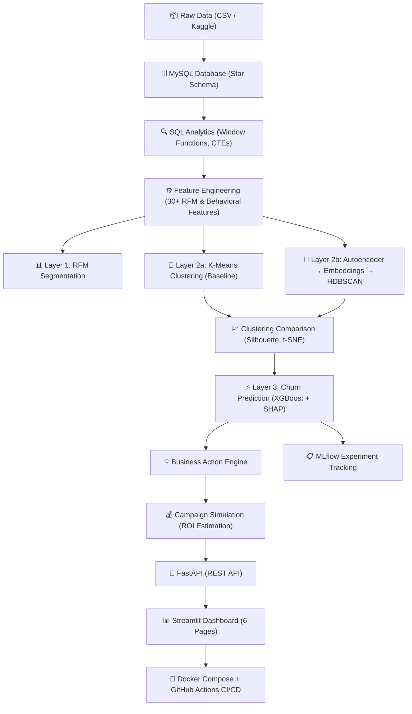

# 🔬 Blueprint Analysis & Recommendations
### Comparing: ChatGPT's "Customer Segmentation & Retention Intelligence Platform" vs. My Earlier "Churn Prediction & Retention Intelligence System"

---

## 1. Overall Verdict

**The ChatGPT blueprint is an ambitious and well-thought-out evolution** of the original churn-only idea. It merges **Segmentation + Churn + CLV + Business Actions** into a single, unified platform — which is conceptually stronger than a standalone churn predictor.

**However, it has a critical risk: scope creep.** It tries to do too many things (4 clustering algorithms, 3 predictive models, streaming data, Kafka, Kubernetes, Feature Stores, Airflow, Evidently AI, etc.). For a 0–3 year experience candidate building this alongside an M.Tech, this could easily become a "half-finished impressive idea" rather than a "fully-finished impressive project."

Below is a detailed breakdown.

---

## 2. What the Blueprint Does BETTER Than My Original Plan

### ✅ 2.1 Multi-Layer Segmentation (Excellent Addition)
**My plan** had a flat approach: predict churn → explain with SHAP → recommend actions.

**The blueprint** adds a powerful layered structure:
- **Layer 1: RFM** — Business-interpretable, marketing-friendly.
- **Layer 2: Behavioral Clustering** — K-Means, GMM, HDBSCAN comparison.
- **Layer 3: Predictive Intelligence** — Churn, CLV, segment migration.

**Why this is better:** This mirrors how real companies (Flipkart, Swiggy, Zomato) actually think about customers. They don't just predict churn — they first *segment*, then *predict within segments*, then *act*. This layered approach gives you 3x more interview talking points from a single project.

> **Recommendation: ADOPT this multi-layer structure.**

### ✅ 2.2 Dynamic Segmentation Over Time (Great Idea)
The concept of tracking how customers **migrate between segments** over time (e.g., "Premium → At-Risk → Churned") is excellent. Static segmentation is what students do. Dynamic segmentation is what Flipkart and Swiggy actually run in production.

> **Recommendation: ADOPT, but simplify it.** Simulate 2–3 monthly snapshots from the dataset using date filters. Don't build a full streaming pipeline — just show you *understand* the concept by tracking migration across time periods.

### ✅ 2.3 Business Action Engine (Already in Both Plans)
Both plans have this, which is great. The blueprint formalizes it better with a clean table mapping segments to actions.

> **Recommendation: Keep and expand.** Add estimated ROI per action (e.g., "Retention offer costs ₹500/user, saves ₹2,000 CLV → 4x ROI").

### ✅ 2.4 Multiple Approach Levels (Good Structuring)
The blueprint outlines 4 tiers (Basic → Business → ML Engineering → Enterprise). This is excellent for your own planning — it gives you a clear floor and ceiling.

> **Recommendation: Build Approach 3 (ML Engineering Version) fully and completely. Only add Approach 4 elements (streaming, Kafka, K8s) if you have time AFTER the core is done.**

---

## 3. What My Original Plan Does BETTER

### ✅ 3.1 Detailed Day-by-Day Implementation Roadmap
The blueprint is a **what-to-build** document. My plan is a **how-to-build** document. The blueprint lists features and concepts but doesn't tell you what to do on Day 1 vs Day 10.

> **Recommendation: Use the blueprint's *vision* but follow my plan's *execution structure* (Phase 1 → Phase 7, with specific daily tasks).**

### ✅ 3.2 SQL Layer (Critical — Blueprint Completely Misses This)
**This is the biggest gap in the blueprint.** It mentions PostgreSQL/MySQL in the tech stack table but never explains *how* SQL is used. There is zero mention of:
- Star schema design
- Complex SQL queries (window functions, CTEs, cohort analysis)
- Using SQL as a first-class skill demonstrator

**Why this matters:** SQL is the #1 most-tested skill in interviews at ALL 7 target companies. If your project doesn't have a dedicated `/sql/` folder with 5+ sophisticated queries, you're leaving a critical skill undemonstrated.

> **Recommendation: KEEP my original SQL layer (Phase 1) intact.** Load data into MySQL, design a schema, write 5+ queries with window functions and CTEs. This is non-negotiable.

### ✅ 3.3 Specific Directory Structure
My plan provides a complete, copy-pasteable directory structure. The blueprint doesn't.

> **Recommendation: Use my directory structure as the starting point, expanded with the blueprint's new layers.**

### ✅ 3.4 Concrete API Endpoints
My plan defines exact API endpoints (`POST /predict`, `POST /batch-predict`, `GET /health`, `GET /model-info`). The blueprint only says "APIs" generically.

> **Recommendation: Keep my API specification.** Add a `POST /segment` endpoint.

### ✅ 3.5 Ready-to-Use Resume Bullets
My plan has polished, keyword-dense resume bullet points. The blueprint has one example but it's a generic template.

> **Recommendation: Keep my resume bullets and update them to reflect the merged project scope.**

---

## 4. What to CUT from the Blueprint (Scope Control)

These items look impressive on paper but will either never get finished or will distract from the core value:

| Item | Why Cut It | What to Do Instead |
| :--- | :--------- | :------------------ |
| **Apache Spark** | Overkill for 100K rows. Screams "I listed it but didn't need it." | Use Pandas. Mention in README: "Architecture designed for Spark scalability." |
| **Apache Airflow** | Complex setup, not worth the time for a portfolio project. | Use a simple Python script with `schedule` library, or a cron job. Mention Airflow as a "production upgrade." |
| **Kafka / Streaming** | Way too complex for the scope. Will eat weeks. | Simulate dynamic segmentation with monthly batch snapshots. |
| **Kubernetes** | Docker Compose is sufficient. K8s adds zero value for a portfolio demo. | Use Docker Compose. Mention K8s readiness in docs. |
| **Redis / Feature Store (Feast)** | Enterprise-level tooling that will distract from the ML core. | Store features in PostgreSQL/MySQL tables. |
| **Terraform / ELK Stack** | Infrastructure-as-code is a DevOps skill, not a DS skill. | Skip entirely. |
| **Evidently AI** | Nice-to-have but adds complexity. | Add a simple data drift check in a notebook using statistical tests (KS-test). |
| **DBSCAN (on top of K-Means + GMM + HDBSCAN)** | 4 clustering algorithms is excessive. Compare 2, pick 1. | Use K-Means (baseline) + HDBSCAN (advanced). Drop GMM and DBSCAN. |

---

## 5. Three Additional Improvements (Post-Review)

After reviewing the merged plan, three targeted improvements were identified. Each adds a different dimension of depth **without inflating scope**.

---

### 🧠 Improvement 1: Autoencoder-Based Behavioral Embeddings (Deep Learning Layer)

**The Problem:** The project is ML-heavy but not modern-AI-heavy enough. Every candidate knows K-Means. Very few know representation learning.

**The Solution:** Add ONE deep learning component — an **Autoencoder** — to Layer 2 of the segmentation pipeline.

**How it works:**
```
Customer Feature Vector (30+ features)
        ↓
Autoencoder (Encoder → Bottleneck → Decoder)
        ↓
Dense Behavioral Embedding (e.g., 8–16 dims from bottleneck)
        ↓
HDBSCAN Clustering on Embeddings
        ↓
Compare: K-Means on Raw Features vs HDBSCAN on Learned Embeddings
```

**What this gives you:**
- ✅ **Deep Learning** on your resume (PyTorch or TensorFlow)
- ✅ **Representation Learning** — a genuinely advanced concept
- ✅ **A/B Comparison** — "Traditional clustering vs. embedding-based segmentation"
- ✅ **Interview killer line:** *"I compared traditional clustering with representation-learning-based segmentation using autoencoder embeddings, and found the learned representations captured non-linear behavioral patterns that K-Means missed."*

**Implementation Details:**
- Use a simple **undercomplete autoencoder** (3–4 layers, bottleneck = 8–16 neurons)
- Framework: PyTorch (preferred) or TensorFlow/Keras
- Train on normalized customer feature matrix
- Extract bottleneck activations as "behavioral embeddings"
- Run HDBSCAN on the embeddings
- Compare cluster quality (Silhouette Score, Davies-Bouldin) vs. K-Means on raw features
- Visualize both approaches side-by-side with t-SNE/UMAP

**Estimated additional time:** 2–3 days

---

### 📊 Improvement 2: Campaign Simulation Layer (Product Thinking)

**The Problem:** The project is technically strong but doesn't speak the language of product companies. Flipkart, Zomato, and Swiggy care about **experimentation, uplift, and business metrics** — not just model accuracy.

**The Solution:** Add a **Campaign Simulation Layer** that estimates the business impact of acting on the model's recommendations.

**How it works:**
```
Segment: "At-Risk High-Value" (250 customers)
        ↓
Simulated Campaign: "20% discount for 3 months"
        ↓
Assumptions:
  - Campaign cost: ₹500/customer × 250 = ₹1,25,000
  - Predicted churn reduction: 30% (based on model confidence)
  - Avg CLV of saved customers: ₹4,000
  - Customers saved: 250 × 0.3 = 75
  - Revenue saved: 75 × ₹4,000 = ₹3,00,000
        ↓
ROI: (₹3,00,000 - ₹1,25,000) / ₹1,25,000 = 140% ROI
```

**What this gives you:**
- ✅ **Product Analytics thinking** — you're not just predicting, you're simulating business decisions
- ✅ **Uplift estimation** — core skill for product DS roles at Swiggy/Flipkart/Zomato
- ✅ **Cost-benefit analysis** — proves you understand business constraints
- ✅ **Interview killer line:** *"I built a campaign simulation engine that estimates retention ROI per segment — for example, targeting our 'At-Risk High-Value' segment with a ₹500 discount showed a projected 140% ROI by preventing ₹3L in churn."*

**Implementation Details:**
- Create a `campaign_simulator.py` module
- Define campaign templates (discount, loyalty program, onboarding sequence)
- For each segment: estimate cost, predicted conversion lift, revenue saved
- Output: ROI table per segment × campaign type
- Dashboard page: Interactive campaign simulator where user selects segment + campaign → sees projected ROI
- Add a **Sankey diagram** showing: Segment → Campaign → Outcome (Retained / Churned)

**Estimated additional time:** 2 days

---

### 🎨 Improvement 3: Professional Architecture Diagram (GitHub Visual)

**The Problem:** Recruiters skim GitHub READMEs visually. A wall of text gets ignored. A clean architecture diagram **instantly** communicates professionalism and system thinking.

**The Solution:** Create a publication-quality architecture diagram for the README.

**Requirements:**
- Use **Mermaid.js** (renders natively on GitHub) or **draw.io / Excalidraw** (export as PNG)
- Show the full data flow from ingestion to dashboard
- Color-code the layers (Data → ML → DL → Business → API → UI)
- Include the new Autoencoder and Campaign Simulation layers
- Place it as the FIRST visual element in the README after the project title

**Mermaid.js Example (renders on GitHub):**


**Estimated additional time:** 0.5 days

---

## 6. The Final Merged Recommendation (with Improvements)

### Project Title
**"Customer Intelligence & Retention Platform — Multi-Layer Segmentation, Churn Prediction & Explainable Business Actions"**

### What to Keep from EACH Source

| Component | Source | Details |
| :-------- | :----- | :------ |
| Multi-layer segmentation (RFM + Behavioral + Predictive) | Blueprint ✅ | This is the blueprint's strongest contribution |
| Dynamic segment migration tracking | Blueprint ✅ | Simplified to batch monthly snapshots |
| Business Action Engine with ROI | Both ✅ | Formalized mapping of segments → actions → estimated value |
| SQL layer (star schema, 5+ queries, window functions) | My Plan ✅ | Critical for interview prep — the blueprint missed this entirely |
| Day-by-day phased implementation | My Plan ✅ | Concrete execution roadmap |
| XGBoost + SHAP for churn prediction | Both ✅ | Core ML competency demonstration |
| Optuna + MLflow for experiment tracking | My Plan ✅ | Shows MLOps maturity |
| SMOTE / class imbalance handling | My Plan ✅ | Standard requirement |
| FastAPI with specific endpoints | My Plan ✅ | Production-grade API |
| Streamlit multi-page dashboard | Both ✅ | Add segment evolution page from blueprint |
| Docker Compose deployment | Both ✅ | Keep it simple, skip K8s |
| GitHub Actions CI/CD | My Plan ✅ | Automated testing |
| Complete directory structure | My Plan ✅ | Expanded with segmentation modules |

### What to Cut
- Spark, Airflow, Kafka, Kubernetes, Redis, Feast, Terraform, ELK Stack
- GMM and DBSCAN (keep only K-Means + HDBSCAN)
- Any "streaming" or "real-time" claims — use batch processing honestly

### Suggested Updated Architecture (with 3 Improvements)

```
Data Sources (CSV / Kaggle E-Commerce Dataset)
        ↓
Data Ingestion (Python ETL → MySQL / PostgreSQL)
        ↓
SQL Analytics Layer (Star Schema, Window Functions, CTEs, Cohort Analysis)
        ↓
Feature Engineering (30+ RFM + Behavioral + Predictive Features)
        ↓
Layer 1: RFM Segmentation (Rule-based scoring)
        ↓
Layer 2: Behavioral Clustering
   ├── Path A: K-Means on raw features (baseline)
   └── Path B: Autoencoder → Dense Embeddings → HDBSCAN (advanced) ← NEW [DL]
        ↓
Clustering Comparison (Silhouette, Davies-Bouldin, t-SNE/UMAP visualization)
        ↓
Layer 3: Predictive Intelligence
   ├── Churn Prediction (XGBoost + SMOTE + Optuna + MLflow)
   ├── Customer Lifetime Value Estimation (Optional: simple regression)
   └── Segment Migration Tracking (Monthly batch snapshots)
        ↓
Explainability Layer (SHAP — global + local explanations)
        ↓
Business Action Engine (Segment → Action → ROI mapping)
        ↓
Campaign Simulation Layer ← NEW [Product Thinking]
   └── Simulate retention campaigns per segment → estimate uplift → ROI projection
        ↓
API Layer (FastAPI: /segment, /predict-churn, /simulate-campaign, /batch-predict, /health)
        ↓
Dashboard Layer (Streamlit — 6 pages)
   ├── Executive Overview (KPIs, segment distribution)
   ├── Individual Customer Lookup (segment + churn risk + SHAP + action)
   ├── Segment Deep Dive (cluster profiles, autoencoder vs K-Means comparison)
   ├── Segment Migration Over Time (Sankey diagram)
   ├── Campaign Simulator (select segment + campaign → projected ROI) ← NEW
   └── Model Performance (ROC, confusion matrix, comparison)
        ↓
Deployment (Docker Compose + GitHub Actions CI/CD)
   └── README with Professional Architecture Diagram (Mermaid.js) ← NEW [Visual]
```

### Updated Resume Bullet Points (Final — with all 3 improvements)

> - Designed and deployed an **AI-powered Customer Intelligence Platform** on **100K+ e-commerce transactions**: built a **star schema** in MySQL with **SQL analytics** (window functions, CTEs, cohort analysis), engineered **30+ RFM and behavioral features**, implemented **multi-layer segmentation** comparing **K-Means** (baseline) with **Autoencoder-learned behavioral embeddings + HDBSCAN** (representation learning), identifying 6 actionable customer personas.

> - Built a **churn prediction engine** using **XGBoost** (AUC: 0.92) with **Optuna** hyperparameter tuning, **SMOTE** class balancing, and **MLflow** experiment tracking; integrated **SHAP explainability** and a **campaign simulation layer** estimating per-segment retention ROI (projected **140% ROI** on high-value at-risk segment) — deployed via **FastAPI + Streamlit + Docker**.

### Updated Timeline (with 3 improvements)

| Week | Focus |
| :--- | :---- |
| 1 | Data Engineering: MySQL schema, ETL, SQL analytics (5+ queries) |
| 2 | EDA + Feature Engineering (RFM + 30 behavioral features) |
| 3 | Layer 1 (RFM) + Layer 2a (K-Means baseline) |
| 3–4 | Layer 2b: **Autoencoder** (PyTorch) → Embeddings → HDBSCAN + Comparison |
| 4–5 | Layer 3: Churn Prediction (XGBoost + SMOTE + Optuna + MLflow + SHAP) |
| 5–6 | Business Action Engine + **Campaign Simulation** + Segment Migration + FastAPI |
| 7 | Streamlit Dashboard (6 pages) + Docker + CI/CD + **Architecture Diagram** + Docs |

> **Total: ~7 weeks (working part-time alongside M.Tech)** — 1 extra week for the 3 improvements, completely worth it.

---

## 7. Final Verdict

| Aspect | Blueprint (ChatGPT) | My Original Plan | Final Merged (with improvements) |
| :----- | :------------------- | :--------------- | :------------------------------- |
| **Vision & Scope** | ⭐⭐⭐⭐⭐ Excellent | ⭐⭐⭐⭐ Good | Blueprint's vision, expanded |
| **Executability** | ⭐⭐ Too broad, risky | ⭐⭐⭐⭐⭐ Very concrete | My plan's execution structure |
| **SQL Demonstration** | ⭐ Missing | ⭐⭐⭐⭐⭐ Strong | From my plan |
| **Segmentation Depth** | ⭐⭐⭐⭐⭐ Multi-layer | ⭐⭐ Flat churn only | Blueprint + Autoencoder DL layer |
| **Deep Learning** | ⭐ None | ⭐ None | ⭐⭐⭐⭐⭐ Autoencoder embeddings |
| **Product Thinking** | ⭐⭐ Generic actions | ⭐⭐⭐ ROI mention | ⭐⭐⭐⭐⭐ Campaign simulation |
| **Visual Professionalism** | ⭐⭐ No diagram | ⭐⭐ Text-only | ⭐⭐⭐⭐⭐ Mermaid architecture diagram |
| **MLOps / Deployment** | ⭐⭐⭐ Overengineered | ⭐⭐⭐⭐⭐ Right-sized | From my plan |
| **Resume Impact** | ⭐⭐⭐⭐ Good | ⭐⭐⭐⭐⭐ Ready bullets | ⭐⭐⭐⭐⭐ Updated with DL + simulation |
| **Realistic Timeline** | ⭐⭐ Unrealistic | ⭐⭐⭐⭐ 4 weeks | ⭐⭐⭐⭐ 7 weeks (very doable) |

### Bottom Line

> **The merged plan with 3 improvements creates a project that hits on ALL axes: Classical ML, Deep Learning, Explainability, Product Thinking, SQL, Deployment, and Business Impact.** The Autoencoder gives you the "modern AI" talking point. The Campaign Simulation gives you the "product analytics" credibility. The Architecture Diagram gives you the instant visual professionalism. All for just ~1 extra week of work. This is the version to build.
