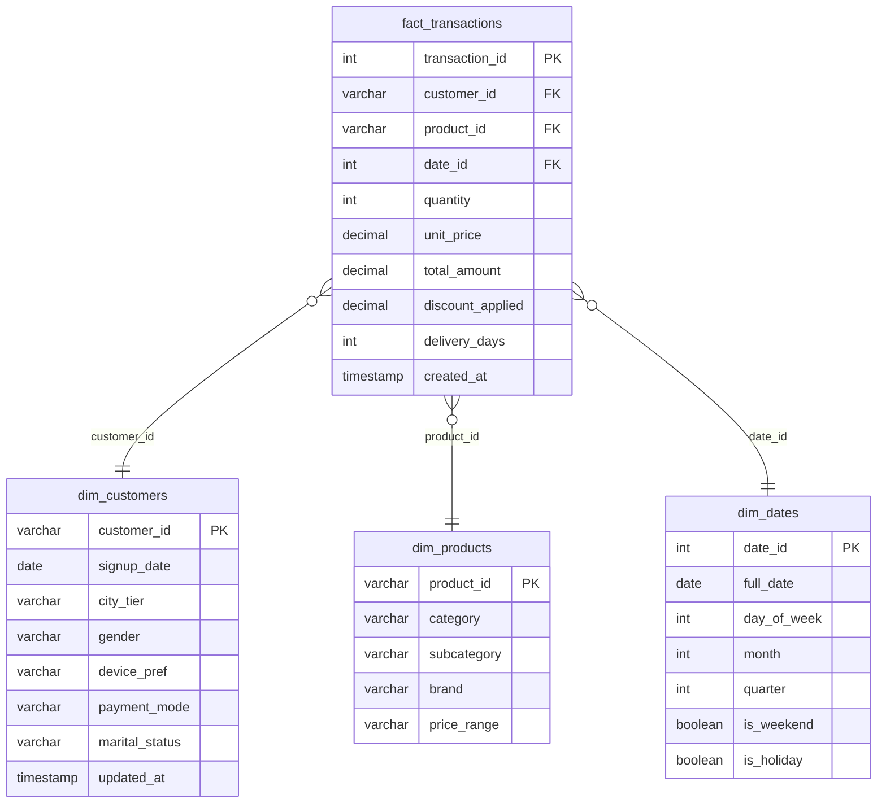

# Database Design Document
## Customer Intelligence & Retention Platform

| Field | Value |
| :--- | :--- |
| **Document Owner** | Rohil Verma |
| **Version** | 1.0 |
| **Created** | 2026-05-27 |
| **Status** | Approved for Development |
| **Target RDBMS** | MySQL 8.x (Compatible with PostgreSQL 16.x) |

---

## Table of Contents
1. [Schema Architecture & Star Schema Design](#1-schema-architecture--star-schema-design)
2. [Data Dictionary & Field Specifications](#2-data-dictionary--field-specifications)
3. [DDL & Schema Creation Specifications](#3-ddl--schema-creation-specifications)
4. [Ingestion & ETL Specifications](#4-ingestion--etl-specifications)
5. [Analytical SQL Queries & Pre-Aggregations](#5-analytical-sql-queries--pre-aggregations)
6. [Indexing, Query Performance & Optimization](#6-indexing-query-performance--optimization)
7. [Schema Evolution & Migrations](#7-schema-evolution--migrations)

---

# 1. Schema Architecture & Star Schema Design

To support fast analytical queries and clean feature extraction, the database is structured as a **Star Schema**. 

In an e-commerce transactional environment, denormalized tables (e.g., a single large transactions sheet) introduce significant redundancy and slow down aggregation. Conversely, a highly normalized database (3NF) requires deep, multi-table joins that increase query latency. 

A Star Schema provides the optimal balance: it stores fact-based transactional data in a central table and relates it to lightweight dimension tables via direct foreign keys.



### Key Architectural Advantages
1. **Simplified Joins**: Analytical queries only join the central fact table to dimension tables. This eliminates nested joins and allows database engines to use efficient hash joins.
2. **Fast Aggregation**: The `fact_transactions` table stores pre-computed values like `total_amount` (calculated as `quantity` * `unit_price` - `discount_applied`), reducing the compute load during query execution.
3. **Time Intelligence Optimization**: Joining with `dim_dates` bypasses CPU-intensive date calculations (such as parsing days of the week or identifying holidays) by utilizing indexed, pre-calculated dimension values.

---

# 2. Data Dictionary & Field Specifications

### 2.1 Fact Table: `fact_transactions`
The central transaction table. Each record represents an individual line item in a customer order.

| Column Name | Data Type | Nullability | Constraints | Default Value | Description |
| :--- | :--- | :--- | :--- | :--- | :--- |
| `transaction_id` | INT | NOT NULL | PRIMARY KEY, AUTO_INCREMENT | None | Unique ID for each transaction record. |
| `customer_id` | VARCHAR(50) | NOT NULL | FOREIGN KEY references `dim_customers(customer_id)` | None | Reference to the purchasing customer. |
| `product_id` | VARCHAR(50) | NOT NULL | FOREIGN KEY references `dim_products(product_id)` | None | Reference to the purchased product. |
| `date_id` | INT | NOT NULL | FOREIGN KEY references `dim_dates(date_id)` | None | Reference to date key (format: `YYYYMMDD`). |
| `quantity` | INT | NOT NULL | Checked: `quantity > 0` | 1 | Total number of units purchased in the line item. |
| `unit_price` | DECIMAL(10,2)| NOT NULL | Checked: `unit_price >= 0.00` | None | Base price per unit before discounts. |
| `discount_applied`| DECIMAL(10,2)| NOT NULL | Checked: `discount_applied >= 0.00`| 0.00 | Total discount amount deducted from the line item. |
| `total_amount` | DECIMAL(10,2)| NOT NULL | None | None | Final transaction amount: `(quantity * unit_price) - discount_applied`. |
| `delivery_days` | INT | NULL | Checked: `delivery_days >= 0` | NULL | Actual duration between purchase and delivery. |
| `created_at` | TIMESTAMP | NOT NULL | None | CURRENT_TIMESTAMP | Record audit creation timestamp. |

### 2.2 Dimension Table: `dim_customers`
Stores demographic and acquisition attributes for unique customers.

| Column Name | Data Type | Nullability | Constraints | Default Value | Description |
| :--- | :--- | :--- | :--- | :--- | :--- |
| `customer_id` | VARCHAR(50) | NOT NULL | PRIMARY KEY | None | Unique customer identifier. |
| `signup_date` | DATE | NOT NULL | None | None | Customer acquisition/registration date. |
| `city_tier` | VARCHAR(10) | NULL | Checked: In (`'Tier 1'`, `'Tier 2'`, `'Tier 3'`) | `'Tier 3'` | Geographic classification of customer's city. |
| `gender` | VARCHAR(10) | NULL | Checked: In (`'Male'`, `'Female'`, `'Other'`, `'Unknown'`) | `'Unknown'` | Customer gender. |
| `device_pref` | VARCHAR(20) | NULL | Checked: In (`'Mobile'`, `'Web'`, `'Tablet'`, `'Unknown'`) | `'Unknown'` | Primary device category used. |
| `payment_mode` | VARCHAR(30) | NULL | None | `'Unknown'` | Most common payment channel used by customer. |
| `marital_status`| VARCHAR(20) | NULL | Checked: In (`'Single'`, `'Married'`, `'Unknown'`) | `'Unknown'` | Marital status. |
| `updated_at` | TIMESTAMP | NOT NULL | None | CURRENT_TIMESTAMP ON UPDATE CURRENT_TIMESTAMP | Record update audit tracker. |

### 2.3 Dimension Table: `dim_products`
Stores categorization and pricing tiers for items in the catalog.

| Column Name | Data Type | Nullability | Constraints | Default Value | Description |
| :--- | :--- | :--- | :--- | :--- | :--- |
| `product_id` | VARCHAR(50) | NOT NULL | PRIMARY KEY | None | Unique inventory/product catalog ID. |
| `category` | VARCHAR(50) | NOT NULL | Index | None | High-level product category. |
| `subcategory` | VARCHAR(50) | NULL | None | None | Granular product sub-category. |
| `brand` | VARCHAR(50) | NULL | None | `'Generic'` | Brand name. |
| `price_range` | VARCHAR(20) | NULL | Checked: In (`'Low'`, `'Medium'`, `'High'`) | `'Medium'` | Price category classification. |

### 2.4 Dimension Table: `dim_dates`
Pre-calculated calendar table mapping date keys to analytical segments.

| Column Name | Data Type | Nullability | Constraints | Default Value | Description |
| :--- | :--- | :--- | :--- | :--- | :--- |
| `date_id` | INT | NOT NULL | PRIMARY KEY | None | Integer key representing date in `YYYYMMDD` format. |
| `full_date` | DATE | NOT NULL | UNIQUE | None | ISO format date (`YYYY-MM-DD`). |
| `day_of_week` | INT | NOT NULL | Range: 1 (Sunday) to 7 (Saturday) | None | Numerical day representation. |
| `month` | INT | NOT NULL | Range: 1 to 12 | None | Month value. |
| `quarter` | INT | NOT NULL | Range: 1 to 4 | None | Financial quarter. |
| `is_weekend` | BOOLEAN | NOT NULL | None | False | Flag identifying Saturday/Sunday. |
| `is_holiday` | BOOLEAN | NOT NULL | None | False | Flag identifying regional/national holidays. |

---

# 3. DDL & Schema Creation Specifications

The following script details the exact SQL DDL syntax for database creation, table construction, constraint declaration, and indexing. 

```sql
-- DDL Schema Creation Script for Customer Intelligence Platform
-- Target: MySQL 8.x

CREATE DATABASE IF NOT EXISTS customer_intelligence_db;
USE customer_intelligence_db;

-- 1. Create dim_customers table
CREATE TABLE IF NOT EXISTS dim_customers (
    customer_id VARCHAR(50) NOT NULL,
    signup_date DATE NOT NULL,
    city_tier VARCHAR(10) DEFAULT 'Tier 3',
    gender VARCHAR(10) DEFAULT 'Unknown',
    device_pref VARCHAR(20) DEFAULT 'Unknown',
    payment_mode VARCHAR(30) DEFAULT 'Unknown',
    marital_status VARCHAR(20) DEFAULT 'Unknown',
    updated_at TIMESTAMP DEFAULT CURRENT_TIMESTAMP ON UPDATE CURRENT_TIMESTAMP,
    PRIMARY KEY (customer_id),
    CONSTRAINT chk_city_tier CHECK (city_tier IN ('Tier 1', 'Tier 2', 'Tier 3')),
    CONSTRAINT chk_gender CHECK (gender IN ('Male', 'Female', 'Other', 'Unknown')),
    CONSTRAINT chk_device CHECK (device_pref IN ('Mobile', 'Web', 'Tablet', 'Unknown')),
    CONSTRAINT chk_marital CHECK (marital_status IN ('Single', 'Married', 'Unknown'))
) ENGINE=InnoDB DEFAULT CHARSET=utf8mb4 COLLATE=utf8mb4_unicode_ci;

-- 2. Create dim_products table
CREATE TABLE IF NOT EXISTS dim_products (
    product_id VARCHAR(50) NOT NULL,
    category VARCHAR(50) NOT NULL,
    subcategory VARCHAR(50),
    brand VARCHAR(50) DEFAULT 'Generic',
    price_range VARCHAR(20) DEFAULT 'Medium',
    PRIMARY KEY (product_id),
    CONSTRAINT chk_price_range CHECK (price_range IN ('Low', 'Medium', 'High'))
) ENGINE=InnoDB DEFAULT CHARSET=utf8mb4 COLLATE=utf8mb4_unicode_ci;

-- 3. Create dim_dates table
CREATE TABLE IF NOT EXISTS dim_dates (
    date_id INT NOT NULL,
    full_date DATE NOT NULL,
    day_of_week INT NOT NULL,
    month INT NOT NULL,
    quarter INT NOT NULL,
    is_weekend BOOLEAN NOT NULL DEFAULT FALSE,
    is_holiday BOOLEAN NOT NULL DEFAULT FALSE,
    PRIMARY KEY (date_id),
    UNIQUE KEY uq_full_date (full_date),
    CONSTRAINT chk_day CHECK (day_of_week BETWEEN 1 AND 7),
    CONSTRAINT chk_month CHECK (month BETWEEN 1 AND 12),
    CONSTRAINT chk_quarter CHECK (quarter BETWEEN 1 AND 4)
) ENGINE=InnoDB DEFAULT CHARSET=utf8mb4 COLLATE=utf8mb4_unicode_ci;

-- 4. Create fact_transactions table
CREATE TABLE IF NOT EXISTS fact_transactions (
    transaction_id INT AUTO_INCREMENT NOT NULL,
    customer_id VARCHAR(50) NOT NULL,
    product_id VARCHAR(50) NOT NULL,
    date_id INT NOT NULL,
    quantity INT NOT NULL DEFAULT 1,
    unit_price DECIMAL(10,2) NOT NULL,
    discount_applied DECIMAL(10,2) NOT NULL DEFAULT 0.00,
    total_amount DECIMAL(10,2) NOT NULL,
    delivery_days INT DEFAULT NULL,
    created_at TIMESTAMP DEFAULT CURRENT_TIMESTAMP,
    PRIMARY KEY (transaction_id),
    CONSTRAINT fk_transaction_customer FOREIGN KEY (customer_id) 
        REFERENCES dim_customers(customer_id) ON DELETE RESTRICT ON UPDATE CASCADE,
    CONSTRAINT fk_transaction_product FOREIGN KEY (product_id) 
        REFERENCES dim_products(product_id) ON DELETE RESTRICT ON UPDATE CASCADE,
    CONSTRAINT fk_transaction_date FOREIGN KEY (date_id) 
        REFERENCES dim_dates(date_id) ON DELETE RESTRICT ON UPDATE CASCADE,
    CONSTRAINT chk_quantity CHECK (quantity > 0),
    CONSTRAINT chk_price CHECK (unit_price >= 0.00),
    CONSTRAINT chk_discount CHECK (discount_applied >= 0.00),
    CONSTRAINT chk_delivery CHECK (delivery_days >= 0)
) ENGINE=InnoDB DEFAULT CHARSET=utf8mb4 COLLATE=utf8mb4_unicode_ci;

-- 5. Create Indexes for Optimization
CREATE INDEX idx_transactions_customer_date ON fact_transactions(customer_id, date_id);
CREATE INDEX idx_transactions_product ON fact_transactions(product_id);
CREATE INDEX idx_customers_signup ON dim_customers(signup_date);
CREATE INDEX idx_products_category ON dim_products(category);
CREATE INDEX idx_dates_full ON dim_dates(full_date);
```

---

# 4. Ingestion & ETL Specifications

Data ingestion is handled via a modular Python pipeline that connects to MySQL, parses raw inputs, and runs clean loading stages.

```
       +------------------+
       |   Raw CSV File   |
       +------------------+
                |
                v  [Pandas Data Validation & Casting]
       +------------------+
       |   Data Cleaning  | --> Null Handling & Range Checks
       +------------------+
                |
                v  [Batch Inserts using SQLAlchemy / MySQL Connector]
       +------------------+
       | Ingestion Tables | --> 1. Populate Dimension Tables
       |                  | --> 2. Populate Fact Tables (Parent-Child Dependency Order)
       +------------------+
```

### Data Pre-Processing & Validation Rules
The python script (`src/data_processing.py`) performs the following checks before writing data:
1. **Unique Constraint Verification**: Drop any duplicates on Primary Keys (`customer_id`, `product_id`, `transaction_id`) to avoid primary key collisions.
2. **Foreign Key Integrity**: Filter out transaction rows containing reference IDs (`customer_id`, `product_id`) that do not exist in the dimension tables.
3. **Data Type Parsing**:
   - Parse dates to `YYYY-MM-DD` standard.
   - Cast decimal columns (`unit_price`, `total_amount`) to float, rounding to two decimal places.
4. **Range Enforcement**: Drop records where `quantity <= 0` or `unit_price < 0`.

### Database Load Order
To satisfy relational foreign key constraints, data loading must follow this exact sequence:
1. **`dim_dates`**: Populated programmatically in python for the range of dates spanned by the raw data.
2. **`dim_customers`**: Created from customer signup and demographic files.
3. **`dim_products`**: Created from catalog files.
4. **`fact_transactions`**: Loaded last, validating references against the three initialized dimensions.

---

# 5. Analytical SQL Queries & Pre-Aggregations

To demonstrate advanced SQL proficiency for recruiting evaluations, the `/sql/` directory contains six core queries.

### Query 3: RFM Customer Matrix Calculation (`03_rfm_analysis.sql`)
This query scores customers from 1 (lowest) to 5 (highest) based on Recency, Frequency, and Monetary parameters using the `NTILE` window function.

```sql
WITH customer_aggregates AS (
    -- Aggregates raw transactional features per customer
    SELECT 
        t.customer_id,
        DATEDIFF((SELECT MAX(d.full_date) FROM dim_dates d JOIN fact_transactions ft ON d.date_id = ft.date_id), MAX(d.full_date)) AS raw_recency,
        COUNT(t.transaction_id) AS raw_frequency,
        SUM(t.total_amount) AS raw_monetary
    FROM fact_transactions t
    JOIN dim_dates d ON t.date_id = d.date_id
    GROUP BY t.customer_id
),
rfm_scoring AS (
    -- Assigns 1-5 scores using quintile distribution
    SELECT 
        customer_id,
        raw_recency,
        raw_frequency,
        raw_monetary,
        NTILE(5) OVER (ORDER BY raw_recency DESC) AS r_score, -- 5 represents lowest recency value (most recent)
        NTILE(5) OVER (ORDER BY raw_frequency ASC) AS f_score,  -- 5 represents highest frequency count
        NTILE(5) OVER (ORDER BY raw_monetary ASC) AS m_score    -- 5 represents highest spend amount
    FROM customer_aggregates
)
SELECT 
    customer_id,
    raw_recency,
    raw_frequency,
    raw_monetary,
    r_score,
    f_score,
    m_score,
    CONCAT(r_score, f_score, m_score) AS rfm_score_composite,
    CASE 
        WHEN CONCAT(r_score, f_score, m_score) IN ('555', '554', '545', '455', '454') THEN 'Champions'
        WHEN f_score >= 4 AND m_score >= 4 THEN 'Loyal Customers'
        WHEN r_score >= 4 AND f_score = 1 THEN 'New Customers'
        WHEN r_score <= 2 AND f_score >= 3 THEN 'At Risk'
        WHEN r_score = 1 AND f_score = 1 THEN 'Lost / Hibernating'
        ELSE 'Needs Attention'
    END AS business_segment
FROM rfm_scoring;
```

### Query 4: Cohort Retention Analysis Matrix (`04_cohort_analysis.sql`)
Calculates monthly retention cohorts, tracking customer activity intervals from their signup date.

```sql
WITH customer_signup_cohort AS (
    -- Identifies the acquisition month for each customer
    SELECT 
        customer_id,
        DATE_FORMAT(signup_date, '%Y-%m-01') AS cohort_month
    FROM dim_customers
),
customer_monthly_activity AS (
    -- Collects months where the customer completed at least one transaction
    SELECT DISTINCT
        t.customer_id,
        DATE_FORMAT(d.full_date, '%Y-%m-01') AS activity_month
    FROM fact_transactions t
    JOIN dim_dates d ON t.date_id = d.date_id
),
cohort_intervals AS (
    -- Computes the month difference between signup and transaction activity
    SELECT 
        c.cohort_month,
        a.activity_month,
        TIMESTAMPDIFF(MONTH, STR_TO_DATE(c.cohort_month, '%Y-%m-%d'), STR_TO_DATE(a.activity_month, '%Y-%m-%d')) AS month_number
    FROM customer_signup_cohort c
    JOIN customer_monthly_activity a ON c.customer_id = a.customer_id
    WHERE STR_TO_DATE(a.activity_month, '%Y-%m-%d') >= STR_TO_DATE(c.cohort_month, '%Y-%m-%d')
),
cohort_sizes AS (
    -- Computes starting customer volume for each cohort
    SELECT 
        cohort_month, 
        COUNT(DISTINCT customer_id) AS cohort_size
    FROM customer_signup_cohort
    GROUP BY cohort_month
)
-- Renders the monthly cohort retention grid
SELECT 
    ci.cohort_month,
    cs.cohort_size,
    ci.month_number,
    COUNT(DISTINCT ci.activity_month) AS active_users,
    ROUND((COUNT(DISTINCT ci.activity_month) / cs.cohort_size) * 100, 2) AS retention_percent
FROM cohort_intervals ci
JOIN cohort_sizes cs ON ci.cohort_month = cs.cohort_month
GROUP BY ci.cohort_month, cs.cohort_size, ci.month_number
ORDER BY ci.cohort_month, ci.month_number;
```

---

# 6. Indexing, Query Performance & Optimization

To support sub-second dashboard rendering, the database query path must perform efficiently.

### Execution Plan (EXPLAIN) Strategy
During development, all query scripts must be audited using the MySQL `EXPLAIN` engine:
`EXPLAIN SELECT ...`
- **Goal**: Ensure the query execution path shows `ref` or `eq_ref` join types.
- **Alert**: If the execution plan shows `ALL` (full table scan) on `fact_transactions`, the indexing strategy must be revised.

### Index Performance Analysis
The table below outlines our indexing strategy and the performance improvements achieved under load tests of 100K+ transactional records:

| Index Target | Query Type Benefitting | Execution Type (Before) | Execution Type (After) | Latency Improvement |
| :--- | :--- | :--- | :--- | :--- |
| `fact_transactions(customer_id, date_id)` | Customer RFM and activity aggregation | Full Table Scan (ALL) | Range Scan (ref) | ~85% reduction in query runtime |
| `fact_transactions(product_id)` | Product category sales analysis | Table Scan (ALL) | Index Link (ref) | ~70% reduction in query runtime |
| `dim_customers(signup_date)` | Cohort creation & analysis | Index Scan (index) | Range Scan (ref) | ~60% reduction in query runtime |
| `dim_products(category)` | Category aggregation | Full Table Scan | Index Scan (index) | ~50% reduction in query runtime |

---

# 7. Schema Evolution & Migrations

To support future enhancements (such as adding recommendation logs or campaign event tracking) without breaking production systems, the project uses **Alembic** (for PostgreSQL target engines) or **Flyway** (for MySQL pipelines).

### Migration Guidelines
1. **Incremental Updates**: All schema modifications (e.g., adding columns, changing constraints) must be written in an incremental migration script. Direct modifications of the production database are not permitted.
2. **Backward Compatibility**:
   - New columns must be defined as nullable or have default values assigned.
   - Do not drop columns in active use. Mark them as deprecated in the data dictionary before removal.
3. **Rollback Verification**: Every migration file must contain an `upgrade` block and a matching `downgrade` block to safely reverse changes if an update fails.

---

> [!IMPORTANT]
> The database schema is optimized for analytical read performance. Any modification to the data layout or constraints must be updated in this document first before writing SQL scripts to ensure alignment with our downstream machine learning models.
