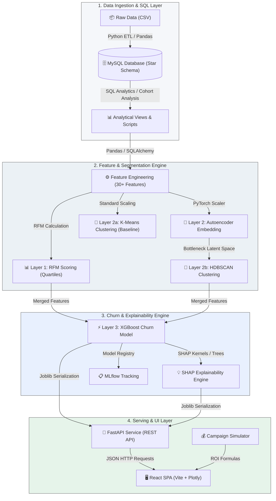
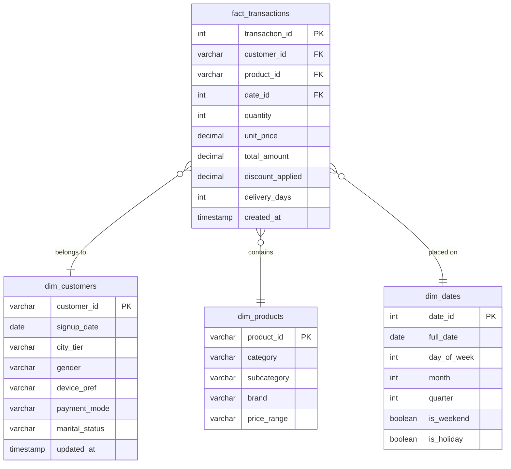

# System Design and Architecture Document
## Customer Intelligence & Retention Platform

| Field | Value |
| :--- | :--- |
| **Document Owner** | Rohil Verma |
| **Version** | 1.0 |
| **Created** | 2026-05-27 |
| **Status** | Draft for Review |
| **Target Systems** | FastAPI, React, Vite, PyTorch, XGBoost, MySQL, Docker |

---

## Table of Contents
1. [Executive Architecture Overview](#1-executive-architecture-overview)
2. [Data Architecture & Schema Design](#2-data-architecture--schema-design)
3. [ETL & Feature Engineering Pipeline](#3-etl--feature-engineering-pipeline)
4. [Multi-Layer Segmentation Engine](#4-multi-layer-segmentation-engine)
5. [Predictive Intelligence & Explainability Layer](#5-predictive-intelligence--explainability-layer)
6. [Business Action & Campaign Simulation Engine](#6-business-action--campaign-simulation-engine)
7. [API Design & Integration Specifications](#7-api-design--integration-specifications)
8. [Dashboard Architecture & Interactive Flow](#8-dashboard-architecture--interactive-flow)
9. [Deployment & Containerization Plan](#9-deployment--containerization-plan)
10. [Design Decisions & Trade-Off Analysis](#10-design-decisions--trade-off-analysis)

---

# 1. Executive Architecture Overview

The **Customer Intelligence & Retention Platform** is designed as a modular, decoupled system that bridges raw database-level transactions with real-time predictive APIs and business simulation interfaces. 

### High-Level Architecture Flow



### Modular Core Components
The system consists of three independent service modules designed for separation of concerns and scaling flexibility:
1. **Data & Pipeline Module (`src/`)**: Handles all data parsing, loading, scaling, feature engineering, and model training tasks. It operates as a local package used during batch offline retraining.
2. **Serving Module (`api/`)**: A FastAPI microservice running inside a Docker container. It loads the serialized model checkpoints (`.joblib`, `.pt`) and exposes highly optimized endpoints for real-time inference, segmentation, and explainability.
3. **Visualization Module (`frontend/`)**: A React SPA running on Vite. It communicates with the FastAPI service via HTTP fetch, displaying executive KPIs, client profiles, interactive ROI models, and model metrics using Plotly.js and Framer Motion.

---

# 2. Data Architecture & Schema Design

The storage layer uses a traditional **Star Schema** optimized for analytical queries, reporting, and feature extraction. The schema is implemented in MySQL (version 8.x).

### Entity-Relationship Diagram



### Table Definitions & Data Types

#### 1. `dim_customers` (Dimension Table)
Stores primary demographic and profile details for unique customers.
- `customer_id` (VARCHAR(50), PK): Unique customer identifier.
- `signup_date` (DATE, NOT NULL): Registration date.
- `city_tier` (VARCHAR(10)): Tier classification of customer's city (Tier 1, Tier 2, Tier 3).
- `gender` (VARCHAR(10)): Gender.
- `device_pref` (VARCHAR(20)): Primary device category used (Mobile, Web, Tablet).
- `payment_mode` (VARCHAR(30)): Most frequently used payment method.
- `marital_status` (VARCHAR(20)): Marital status.

#### 2. `dim_products` (Dimension Table)
Stores catalog attributes for all inventory items.
- `product_id` (VARCHAR(50), PK): Unique catalog identifier.
- `category` (VARCHAR(50), NOT NULL): Top-level product category (e.g., Electronics, Apparel).
- `subcategory` (VARCHAR(50)): Nested product category.
- `brand` (VARCHAR(50)): Brand name.
- `price_range` (VARCHAR(20)): Price tier (Low, Medium, High).

#### 3. `dim_dates` (Dimension Table)
A pre-calculated date dimension to bypass expensive date arithmetic during SQL runtime.
- `date_id` (INT, PK): Date integer in `YYYYMMDD` format.
- `full_date` (DATE, UNIQUE, NOT NULL): Standard date format.
- `day_of_week` (INT): 1 (Sunday) to 7 (Saturday).
- `month` (INT): 1 to 12.
- `quarter` (INT): 1 to 4.
- `is_weekend` (BOOLEAN): `TRUE` if day is Saturday/Sunday.
- `is_holiday` (BOOLEAN): `TRUE` if day corresponds to a calendar holiday.

#### 4. `fact_transactions` (Fact Table)
Stores event-level records of purchases. This table is optimized with indexes on foreign keys to support fast joins.
- `transaction_id` (INT, AUTO_INCREMENT, PK): Unique record identifier.
- `customer_id` (VARCHAR(50), FK): Reference to `dim_customers`.
- `product_id` (VARCHAR(50), FK): Reference to `dim_products`.
- `date_id` (INT, FK): Reference to `dim_dates`.
- `quantity` (INT, NOT NULL): Number of units purchased.
- `unit_price` (DECIMAL(10,2), NOT NULL): Unit price of product.
- `total_amount` (DECIMAL(10,2), NOT NULL): Total value of line item (`quantity` * `unit_price` - `discount_applied`).
- `discount_applied` (DECIMAL(10,2), DEFAULT 0.00): Discount value subtracted.
- `delivery_days` (INT): Actual delivery lead time in days.

### Optimization & Indexing Strategy
To ensure analytical queries perform efficiently, the database utilizes the following indices:
- Composite index on `fact_transactions(customer_id, date_id)` for quick aggregation of customer metrics.
- Indexes on all foreign key columns (`product_id`, `date_id`) inside `fact_transactions`.
- Index on `dim_customers(signup_date)` for fast cohort filtering.

---

# 3. ETL & Feature Engineering Pipeline

The feature engineering pipeline transforms raw transactional logs into a dense feature matrix where each row represents a unique customer.

```
+------------------+     +------------------------+     +-------------------------+
|  MySQL Raw Data  | --> |  SQL Pre-aggregations  | --> |  Pandas Transformations |
+------------------+     +------------------------+     +-------------------------+
                                                                     |
                                                                     v
                                                        +-------------------------+
                                                        |  Feature Matrix Output  |
                                                        +-------------------------+
```

### Data Pipeline Flow
1. **Extraction**: The Python ETL module (`src/data_processing.py`) uses `SQLAlchemy` and `PyMySQL` to connect to the database. It queries transactional data using pre-defined SQL views.
2. **Aggregations**: Initial features are aggregated at the SQL level to minimize memory footprints in Python.
3. **Pandas Feature Engine**: The feature engine (`src/feature_engineering.py`) calculates advanced behavioral metrics, handles missing data, scales variables, and encodes categorical vectors.

### Detailed Feature Specifications (Minimum 30 Features)

#### RFM Features (3)
1. `recency_days`: Days elapsed between the user's latest transaction date and the global data snapshot date.
2. `frequency_total`: Total count of transactions completed by the customer.
3. `monetary_value_total`: Sum of `total_amount` spent by the customer across all transactions.

#### Behavioral Features (20+)
4. `avg_order_value`: Average transaction amount (`monetary_value_total` / `frequency_total`).
5. `purchase_interval_avg`: Mean number of days between consecutive purchases.
6. `basket_diversity`: Unique count of product categories purchased.
7. `discount_dependency_ratio`: Count of transactions utilizing discounts divided by `frequency_total`.
8. `delivery_delay_tolerance_avg`: Mean delivery time experienced across all orders.
9. `refund_frequency`: Count of return/refund transactions completed by the customer.
10. `complaint_count`: Count of service complaints filed.
11. `satisfaction_score_avg`: Mean value of survey feedback ratings (scale 1-5).
12. `tenure_months`: Month difference between `signup_date` and the snapshot date.
13. `coupon_usage_rate`: Count of promotional coupons redeemed divided by the count of promotions sent.
14. `payment_diversity`: Number of unique payment modes utilized in the past transactions.
15. `weekend_spend_ratio`: Spending on weekends divided by total spend.
16. `avg_items_per_order`: Average items purchased per order (`quantity` sum / `frequency_total`).
17. `complaint_ratio`: `complaint_count` / `frequency_total` (helps capture relative friction).
18. `max_spend_single`: Largest transaction amount recorded for the user.
19. `category_affinity_score`: Percentage of total spend concentrated in the customer's top category.
20. `device_mobile_ratio`: Ratio of mobile logins to total logins.
21. `return_rate`: Sum of returned items / total sum of ordered items.
22. `avg_discount_percent`: Mean percentage discount received per order.
23. `cancel_rate`: Ratio of cancelled orders to total orders placed.
24. `spend_variance`: Standard deviation of purchase amounts.

#### Predictive & Time-Trend Features (7+)
25. `spend_velocity_3m`: Linear regression slope of monthly spending over the last 3 months. A negative slope indicates waning engagement.
26. `frequency_velocity_3m`: Slope of monthly purchase counts over the last 3 months.
27. `login_recency_days`: Days since the last user login.
28. `recency_ratio`: `recency_days` / `purchase_interval_avg` (captures if a customer is overdue for their next order).
29. `churn_prob_indicator`: Interaction term between `login_recency_days` and `complaint_count`.
30. `spend_ratio_last_30d`: Ratio of spend in the last 30 days to the average monthly spend.

### Preprocessing & Data Sanitization
- **Handling Missing Values**:
  - `purchase_interval_avg` and `delivery_delay_tolerance_avg` for single-order users are imputed with the median of their cohort.
  - `satisfaction_score_avg` is imputed with the column mean (defaulting to neutral).
  - Categorical missing items are filled with the placeholder label `'UNKNOWN'`.
- **Scaling**: Robust scaling via `RobustScaler` is used on skewed columns (spend, frequency) to minimize outliers. Traditional standard scaling (`StandardScaler`) is applied to features showing normal distributions.
- **Encoding**: Demographic categoricals (`city_tier`, `gender`, `device_pref`, etc.) are processed using One-Hot encoding. High-cardinality values are encoded using target encoding to keep feature space dimensions bounded.

---

# 4. Multi-Layer Segmentation Engine

The segmentation engine operates on two distinct layers: a business-logical RFM layer and an advanced deep learning-driven behavioral clustering layer.

```
                      +-----------------------------+
                      |   Feature Matrix Input      |
                      +-----------------------------+
                                     |
                +--------------------+--------------------+
                v                                         v
    +-----------------------+                 +-----------------------+
    |   Layer 1: RFM        |                 |   Layer 2: Behavioral |
    |   (Quartile Rules)        |                 |   (Autoencoder)       |
    +-----------------------+                 +-----------------------+
                |                                         |
                |                                         v
                |                             +-----------------------+
                |                             |   HDBSCAN Clustering  |
                |                             +-----------------------+
                |                                         |
                +--------------------+--------------------+
                                     v
                      +-----------------------------+
                      |  Unified Customer Profile   |
                      +-----------------------------+
```

### Layer 1: RFM Scoring Model
Provides an easily interpretable, rule-based marketing segmentation.
1. Customers are ranked on Recency, Frequency, and Monetary parameters.
2. Quintiles (1 to 5) are generated for each metric using binning (`pd.qcut`):
   - **Recency**: Score 5 represents the top 20% (most recent); Score 1 represents the bottom 20%.
   - **Frequency**: Score 5 represents the top 20% (most frequent).
   - **Monetary**: Score 5 represents the top 20% (highest spenders).
3. The scores are combined into a composite RFM string (e.g., `"555"` or `"121"`).
4. Composite scores map directly to segment labels via a dictionary mapper:
   - `555`, `554`, `545` $\rightarrow$ **Champions**
   - `553`, `552`, `551`, `453` $\rightarrow$ **Loyal Customers**
   - `511`, `512`, `521`, `411` $\rightarrow$ **Recent Buyers**
   - `311`, `312`, `321`, `221` $\rightarrow$ **At Risk**
   - `111`, `112`, `121`, `122` $\rightarrow$ **Lost / Hibernating**
   - All other combinations $\rightarrow$ **Needs Attention**

### Layer 2a: K-Means Clustering (Baseline)
Fitted directly on standardized behavioral features. Optimal clusters ($K$) are evaluated via:
- **Elbow Method**: Evaluating the sum of squared distances (inertia).
- **Silhouette Coefficient**: Quantifying cluster separation ($s = \frac{b - a}{\max(a, b)}$).

### Layer 2b: Autoencoder + HDBSCAN Clustering (Advanced)
A non-linear deep learning pipeline is used to learn dense representations of user patterns before clustering.

#### 1. PyTorch Autoencoder Specification
An undercomplete neural network trained to reconstruct the normalized customer behavioral feature vectors.

```
   Input (30+ Dimensions) 
             │
             ▼   [Linear + ReLU]
      Encoder Layer 1 (64 units)
             │
             ▼   [Linear + ReLU]
      Encoder Layer 2 (32 units)
             │
             ▼   [Linear + ReLU]
     Bottleneck Embedding (16 Dimensions)  <-- Latent Representation
             │
             ▼   [Linear + ReLU]
      Decoder Layer 1 (32 units)
             │
             ▼   [Linear + ReLU]
      Decoder Layer 2 (64 units)
             │
             ▼   [Linear + Sigmoid/Linear]
   Output Reconstruction (30+ Dimensions)
```

- **Loss Function**: Mean Squared Error (MSE) between input vector $x$ and output reconstruction $\hat{x}$:
  $$\mathcal{L}_{MSE} = \frac{1}{N}\sum_{i=1}^{N}(x_i - \hat{x}_i)^2$$
- **Optimizer**: Adam with learning rate $\eta = 10^{-3}$, weight decay $= 10^{-5}$ for regularization.
- **Training**: 150 epochs with batch size 256. Early stopping halts training if validation loss does not improve for 10 consecutive epochs.

#### 2. HDBSCAN Density Clustering
HDBSCAN is applied on the extracted 16-dimensional bottleneck representations.
- **Metrics**: Euclidean distance metric.
- **Parameters**: `min_cluster_size` = 30 (ensures clusters represent meaningful business segments), `min_samples` = 10 (controls cluster density conservative boundary).
- **Outliers**: HDBSCAN assigns outliers to cluster `-1`. The platform captures these as "unclassified behavioral outliers" for anomaly monitoring.

### Cluster Evaluation and Comparison
To validate the superiority of the Autoencoder + HDBSCAN approach, the dashboard displays side-by-side:
- **UMAP / t-SNE Projections**: High-dimensional features mapped to a 2D canvas.
- **Cluster Quality Metrics**: Silhouette Score and Davies-Bouldin Index comparisons.

---

# 5. Predictive Intelligence & Explainability Layer

Predictive models are trained to calculate the probability of a customer churning.

```
Unified Profile  -->  [SMOTE Oversampling]  -->  [XGBoost Classifier]  -->  Churn Probability
                                                        |
                                                        +-->  [SHAP Engine]  -->  Waterfall/Beeswarm Plots
```

### Layer 3: Churn Prediction Pipeline
- **Target Variable Definition**: Churn is defined based on the dataset's native flag, or custom-constructed as `login_recency_days > 60` or `no purchases in 60 days`.
- **Handling Class Imbalance**:
  1. **SMOTE (Synthetic Minority Over-sampling Technique)**: Applied only to training splits to generate synthetic instances of the minority (churned) class.
  2. **scale_pos_weight**: XGBoost hyperparameter initialized as $\frac{\text{count(negative class)}}{\text{count(positive class)}}$ to adjust loss weights during training.
- **Modeling Algorithms**:
  - **Baseline**: Logistic Regression (high interpretability) and Random Forest (ensemble baseline).
  - **Primary Production Model**: XGBoost (Extreme Gradient Boosting).
- **Hyperparameter Optimization**:
  - Evaluated via 5-Fold Stratified Cross-Validation.
  - Optimizing Objective: ROC-AUC.
  - Hyperparameter tuning is orchestrated via **Optuna** (50 trials) over the search space:

| Hyperparameter | Type | Search Range |
| :--- | :--- | :--- |
| `max_depth` | Integer | 3 to 10 |
| `learning_rate` | Float | 0.01 to 0.20 |
| `n_estimators` | Integer | 100 to 1000 |
| `min_child_weight`| Integer | 1 to 10 |
| `subsample` | Float | 0.6 to 1.0 |
| `colsample_bytree`| Float | 0.6 to 1.0 |
| `gamma` | Float | 0 to 5 |

### Experiment Tracking with MLflow
All model training iterations, hyperparameters, validation metrics (Accuracy, Precision, Recall, F1, ROC-AUC), and serialized model checkpoints are logged automatically to a local MLflow registry.

### Explainable AI (SHAP) Specifications
The platform uses SHAP (SHapley Additive exPlanations) to explain predictions.
- **Kernel/Explainer Type**: TreeExplainer (optimized for tree ensembles like XGBoost).
- **Background Dataset**: A representative sample of 100 customer profiles selected via K-Means centroids to reduce SHAP computation latency.
- **Real-time Explainability**:
  - The API computes local SHAP values for single-customer lookups.
  - The response returns the top three features contributing to the prediction, their SHAP value, and their direction of impact.

---

# 6. Business Action & Campaign Simulation Engine

This layer converts model predictions and cluster categories into actionable business strategies and estimates their ROI.

### Business Action Engine
The engine maps a customer's RFM Segment and Churn Risk Level (determined by model probability thresholds) to a designated retention strategy.

```
                       Churn Probability (p)
                     ┌───────────────────────┐
                     │                       │
           p < 0.30  ▼    0.30 <= p < 0.70   ▼             p >= 0.70
         ┌─────────────┐    ┌─────────────┐    ┌─────────────────────────────────┐
         │  LOW RISK   │    │ MEDIUM RISK │    │            HIGH RISK            │
         └──────┬──────┘    └──────┬──────┘    └────────────────┬────────────────┘
                │                  │                            │
                ▼                  ▼                            ▼
  +--------------------------+  +--------------------------+  +--------------------------+
  |  Champions / Loyal:      |  |  Recent Customers:       |  |  At Risk / Needs Attn:   |
  |  VIP Rewards / Loyalty   |  |  Onboarding Series       |  |  Flat 20% Discount ($500) |
  |  Program (Cost: $150-$200) |  |  (Cost: $100)            |  |  + Outreach (Cost: $300) |
  +--------------------------+  +--------------------------+  +--------------------------+
```

- **Risk Levels**:
  - Churn Probability $p \geq 0.70$ $\rightarrow$ **HIGH RISK**
  - $0.30 \leq p < 0.70$ $\rightarrow$ **MEDIUM RISK**
  - Churn Probability $p < 0.30$ $\rightarrow$ **LOW RISK**

### Campaign Simulator Framework
Estimates the return on investment (ROI) for targeted campaigns.
- **Campaign Templates**:

| Campaign ID | Campaign Name | Cost / Customer ($c$) | Expected Churn Reduction ($r$) |
| :--- | :--- | :--- | :--- |
| `C1` | Flat discount (20%) | ₹500 | 30% |
| `C2` | Loyalty points (2x) | ₹200 | 15% |
| `C3` | Personal outreach call | ₹300 | 25% |
| `C4` | Onboarding email series| ₹50 | 10% |

#### ROI Calculations
Given a target customer segment of size $S$, an average customer lifetime value $CLV$, cost per user $c$, and expected churn reduction $r$:
1. **Target Population Churn Rate**: Let the average churn probability of the selected segment be $\bar{p}$.
2. **Baseline Churned Customers**:
   $$N_{\text{churn}} = S \times \bar{p}$$
3. **Customers Saved by Campaign**:
   $$N_{\text{saved}} = N_{\text{churn}} \times r$$
4. **Total Revenue Saved**:
   $$\text{Revenue Saved} = N_{\text{saved}} \times CLV$$
5. **Total Campaign Cost**:
   $$\text{Campaign Cost} = S \times c$$
6. **Projected Return on Investment (ROI %)**:
   $$\text{ROI (\%)} = \frac{\text{Revenue Saved} - \text{Campaign Cost}}{\text{Campaign Cost}} \times 100$$

### Segment Migration Tracking
Computes changes in customer segments over time by comparing data snapshots from consecutive months (e.g., $M_1$ and $M_2$).
- **Migration Matrix**: A $K \times K$ transition matrix mapping the proportion of customers moving from Segment $i$ in $M_1$ to Segment $j$ in $M_2$.
- **Sankey Visualization**: Generates a flow diagram displaying the migration of customers across segments.

---

# 7. API Design & Integration Specifications

The serving layer is built with FastAPI. It loads models on startup, validates request payloads using Pydantic, and serves five primary endpoints.

### API Endpoint Routing Table

```
API (FastAPI)
 ├── GET  /health ---------------------> Check service health status
 ├── GET  /model-info -----------------> Retrieve serialized metadata
 ├── POST /segment --------------------> Predict customer segment
 ├── POST /predict-churn --------------> Predict churn risk & get SHAP features
 └── POST /simulate-campaign ----------> Project retention campaign ROI
```

### Detailed Endpoint Specifications

#### 1. `GET /health`
Verifies service availability.
- **Response (200 OK)**:
```json
{
  "status": "healthy",
  "model_loaded": true,
  "timestamp": "2026-05-27T16:22:35Z"
}
```

#### 2. `GET /model-info`
Exposes parameters and metadata of the active model.
- **Response (200 OK)**:
```json
{
  "model_type": "XGBoost",
  "version": "v1.0",
  "training_date": "2026-05-20",
  "training_samples": 85000,
  "metrics": {
    "roc_auc": 0.92,
    "f1_score": 0.82,
    "precision": 0.81,
    "recall": 0.83
  }
}
```

#### 3. `POST /segment`
Determines the RFM segment and behavioral cluster for a given customer profile.
- **Request Body**:
```json
{
  "customer_features": {
    "recency_days": 15,
    "frequency_total": 8,
    "monetary_value_total": 4500.0,
    "avg_order_value": 562.5,
    "purchase_interval_days": 21.0,
    "basket_diversity": 4,
    "discount_dependency_ratio": 0.25,
    "login_recency_days": 3
  }
}
```
- **Response (200 OK)**:
```json
{
  "customer_id": null,
  "rfm_scores": {
    "recency": 4,
    "frequency": 4,
    "monetary": 3
  },
  "rfm_segment": "Loyal Customers",
  "behavioral_cluster": 2,
  "cluster_label": "High-Value Frequent Shoppers"
}
```

#### 4. `POST /predict-churn`
Exposes the core predictive logic, including SHAP explainability.
- **Request Body**: (Same feature payload as `/segment`)
- **Response (200 OK)**:
```json
{
  "customer_id": null,
  "churn_probability": 0.76,
  "risk_level": "HIGH",
  "recommended_action": "Flat discount (20%)",
  "top_risk_factors": [
    {
      "feature": "login_recency_days",
      "shap_value": 0.24,
      "direction": "increases_risk"
    },
    {
      "feature": "complaint_count",
      "shap_value": 0.18,
      "direction": "increases_risk"
    },
    {
      "feature": "avg_discount_percent",
      "shap_value": -0.11,
      "direction": "reduces_risk"
    }
  ]
}
```

#### 5. `POST /simulate-campaign`
Calculates targeted campaign ROI projections.
- **Request Body**:
```json
{
  "segment_name": "At Risk",
  "campaign_id": "C1",
  "custom_cost_override": null
}
```
- **Response (200 OK)**:
```json
{
  "segment_name": "At Risk",
  "segment_size": 1500,
  "campaign_name": "Flat discount (20%)",
  "cost_per_user": 500,
  "total_campaign_cost": 750000,
  "assumed_churn_reduction": 0.30,
  "customers_saved": 450,
  "avg_clv": 5200.00,
  "revenue_saved": 2340000.00,
  "roi_percent": 212.0,
  "recommendation": "PROCEED"
}
```

---

# 8. Dashboard Architecture & Interactive Flow

The dashboard is built as a Single Page Application (SPA) using React 19 and Vite. It uses React Router for client-side navigation and a persistent sidebar layout.

### Page-by-Page Components & Layouts

```
[Sidebar Navigation]
 ├── Route /: 🔮 Home ---------------------------> Landing Page with clickable action cards
 ├── Route /executive-overview: 📊 Overview -----> KPIs, Segment Distribution, Churn Risk Breakdown
 ├── Route /customer-lookup: 🔍 Lookup ----------> Single Profile Form, Gauge Indicator, SHAP Bar
 ├── Route /segment-deep-dive: 🎯 Deep Dive -----> Feature Stats, Overlaid Histograms, 3D PCA
 ├── Route /segment-migration: 📈 Migration -----> Heatmap Transition Matrix, Flow Sankey Diagram
 ├── Route /campaign-simulator: 💰 Simulator ----> ROI Estimator UI, Campaign Recommendation Matrix
 └── Route /model-performance: 🏆 Performance ---> Metrics Table, ROC & PR Curves, Feature Importance
```

#### 1. Page 1: Executive Overview
- **Visuals**: Four KPI cards showing total customers, average churn rate, count of high-risk customers, and average CLV.
- **Charts**:
  - Donut chart displaying customer distribution across RFM segments.
  - Stacked bar chart showing total revenue contribution by segment.

#### 2. Page 2: Customer Lookup
- **Visuals**: A form to input customer details manually or select a customer ID.
- **Charts**:
  - A gauge plot showing churn probability (0% to 100%, colored green/yellow/red).
  - A SHAP waterfall plot displaying the top 10 features driving this prediction.
  - Info boxes with the assigned RFM segment and the recommended action.

#### 3. Page 3: Segment Deep Dive
- **Visuals**: Dropdown to select a customer segment.
- **Charts**:
  - Statistical summary table showing mean feature values for the selected segment vs. the population average.
  - Side-by-side t-SNE scatter plots comparing K-Means (baseline) and Autoencoder + HDBSCAN clusters.

#### 4. Page 4: Segment Migration Over Time
- **Visuals**: Slider to select consecutive months.
- **Charts**:
  - Plotly Sankey diagram displaying customer flow from month $M_1$ segments to month $M_2$ segments.
  - Heatmap transition matrix showing migration percentages.

#### 5. Page 5: Campaign Simulator
- **Visuals**: Interactive inputs to select target segment and campaign type.
- **Charts**:
  - ROI metrics cards (Campaign Cost, Customers Saved, Revenue Saved, Net ROI %).
  - Bar chart comparing the ROI of different campaigns for the selected segment.

#### 6. Page 6: Model Performance
- **Visuals**: Summary table comparing Logistic Regression, Random Forest, and XGBoost metrics.
- **Charts**:
  - Overlaid ROC (Receiver Operating Characteristic) and PR (Precision-Recall) curves.
  - Confusion matrix heatmap for the selected model.

---

# 9. Deployment & Containerization Plan

The application is containerized using Docker and Docker Compose, enabling it to run consistently across development, staging, and production environments.

### Docker Compose Multi-Container Orchestration

```
                      +-----------------------------+
                      |       docker-compose        |
                      +-----------------------------+
                                     |
                +--------------------+--------------------+
                v                                         v
    +-----------------------+                 +-----------------------+
    |     FastAPI Container |                 |    React Container    |
    |  - Exposes port 8000  | <============== |  - Exposes port 5173  |
    |  - Loads models       |   REST/HTTP     |  - Reads user input   |
    |  - Handles inference  |                 |  - Renders frontend   |
    +-----------------------+                 +-----------------------+
```

### Dockerfile Specifications

#### 1. FastAPI Service Dockerfile (`api/Dockerfile`)
Uses a slim Python base image. It copies the source directory, config files, and pre-trained model weights.
```dockerfile
FROM python:3.11-slim

WORKDIR /app

RUN apt-get update && apt-get install -y \
    build-essential \
    curl \
    && rm -rf /var/lib/apt/lists/*

COPY requirements.txt .
RUN pip install --no-cache-dir -r requirements.txt

COPY src/ ./src/
COPY api/ ./api/
COPY models/ ./models/

EXPOSE 8000

ENV PYTHONPATH=/app

CMD ["uvicorn", "api.main:app", "--host", "0.0.0.0", "--port", "8000"]
```

#### 2. React SPA Dockerfile (`frontend/Dockerfile`)
Sets up the Node.js frontend application using Vite.
```dockerfile
FROM node:24-alpine

WORKDIR /app

COPY package*.json ./
RUN npm install

COPY . .

EXPOSE 5173

CMD ["npm", "run", "dev", "--", "--host", "0.0.0.0"]
```

#### 3. Orchestration Script (`docker-compose.yml`)
Binds the containers together, sets environment variables, and configures networking.
```yaml
version: '3.8'

services:
  api:
    build:
      context: .
      dockerfile: api/Dockerfile
    ports:
      - "8000:8000"
    environment:
      - ENV=production
      - DB_HOST=db
    volumes:
      - ./models:/app/models
    restart: always

    frontend:
      build:
        context: ./frontend
        dockerfile: Dockerfile
      ports:
        - "5173:5173"
      environment:
        - VITE_API_URL=http://api:8000
      depends_on:
        - api
      restart: always
```

---

# 10. Design Decisions & Trade-Off Analysis

During the design phase, several architectural trade-offs were evaluated. The table below outlines these key choices and the rationale behind each decision.

| Choice Evaluated | Alternative Considered | Chosen Approach | Business & Technical Rationale |
| :--- | :--- | :--- | :--- |
| **Model Explainability** | Random Forest / XGBoost Native Gain | **SHAP values** | Native feature importance metrics show global rankings but cannot explain individual customer predictions. SHAP values provide consistent, mathematically sound explanations for both individual records and the overall model. |
| **Dimensionality Reduction** | Principal Component Analysis (PCA) | **PyTorch Autoencoder** | PCA is restricted to linear projections. Customer transactions and behavioral paths show non-linear relationships. Autoencoders extract complex patterns and learn better latent features for clustering. |
| **Clustering Algorithm** | Gaussian Mixture Models (GMM) | **HDBSCAN** | HDBSCAN is density-based, does not require pre-specifying the number of clusters, handles noise and outliers gracefully, and works well on arbitrary shapes in latent space. |
| **Serving Architecture** | Monolithic Python application | **FastAPI Backend + React SPA** | Separating the backend and frontend allows the model to load in a dedicated API container and the frontend to be a lightning-fast Single Page Application. It uses standard REST APIs allowing multiple consumers. |
| **Experiment Tracking** | Manual spreadsheet tracking | **MLflow Integration** | MLflow automates logging of model parameters, training runs, and evaluations. This ensures model reproducibility and provides a central system to compare candidate models. |
| **Retraining Process** | Real-time streaming updates | **Offline Batch Retraining** | Real-time updates introduce complexity and can lead to model instability from streaming drift. Batch retraining is stable, easier to monitor, and aligns with standard e-commerce retention campaign cycles. |

---

> [!NOTE]
> This System Design document serves as the implementation blueprint for the development phase. Any changes to data schemas, models, or APIs must be reflected here first to maintain documentation integrity.
